# IT Audit Fundamentals Notes

> Did not start notes until Module 2. Intended for personal purposes.

# Module 2, Topic 1: Internal Controls and Control Types

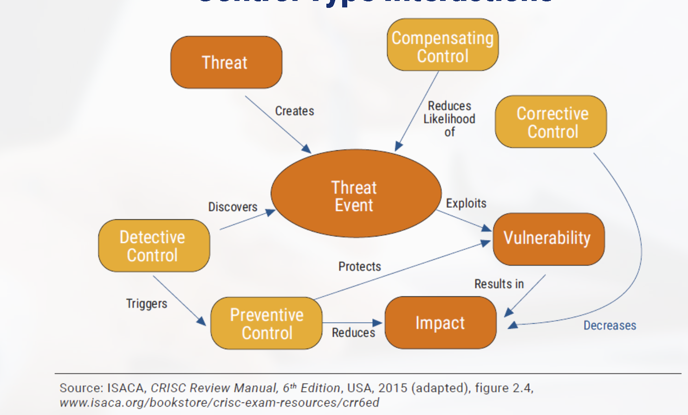

## Control Environment Assessement 

Risk is more severe when:

- Controls are inadequate
- The wrong controls in use
- Controls are ignored or bypassed
- Controls are poorly maintained
- Logs or control data are not reviewed
- Controls are not tested
- Changes to control configurations are not managed
- Controls can be physically accessed and altered
- Control objectives are not appropriately defined

# Module 2, Topic 2: Frameworks, Standards and Guidance

| Standard/Framework | Description |
|-----------|-------------|
| COBIT | ISACA framework, Governance and management of enterprise IT |
| ISACA Risk IT Framework | Tool for risk-based audits that are IT related |
| COSO / ERM | Committee of Sponsoring Organizations (COSO) Enterprise Risk Management (ERM) Framework; Provides common language around risk management |
| ISO / IEC | The International Organization for Standardization (ISO) / International Electrotechnical Commission (IEC); Independent, non-governmental organization that creates international standards covering many different prodcuts and services; voluntary; specific to risk and security management |
| NIST | National Institute of Standards and Technology |

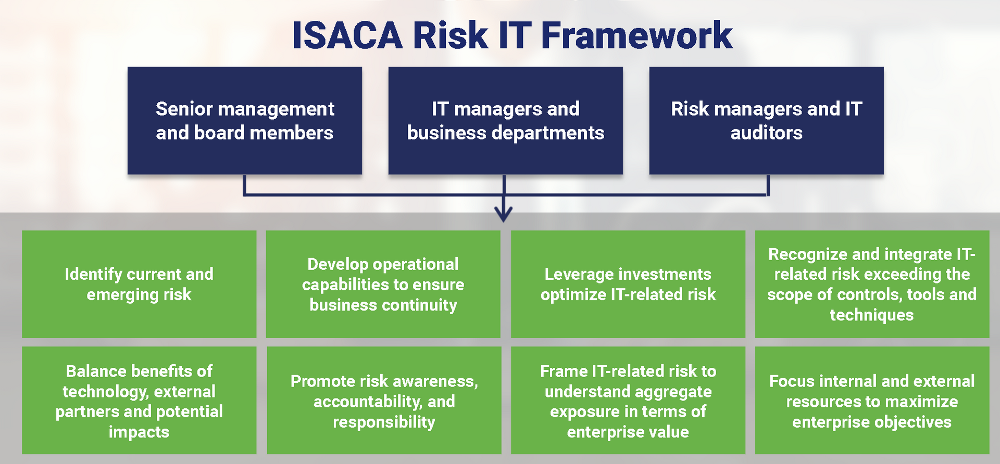

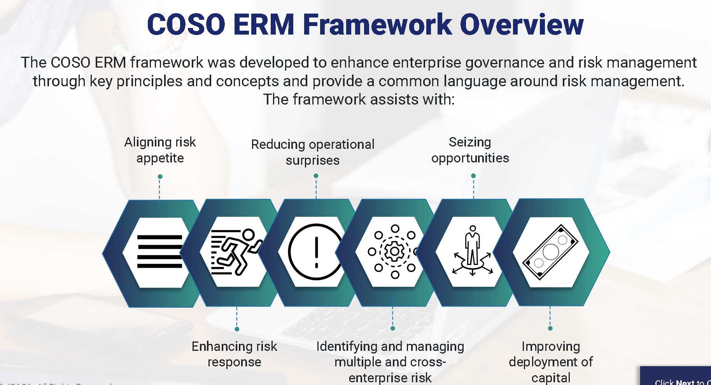

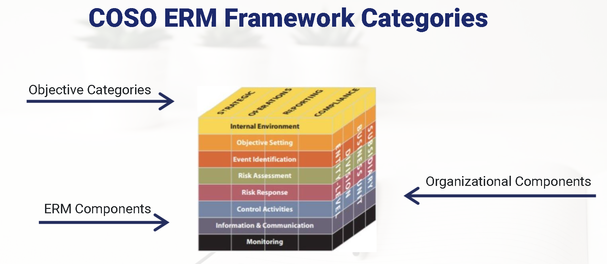

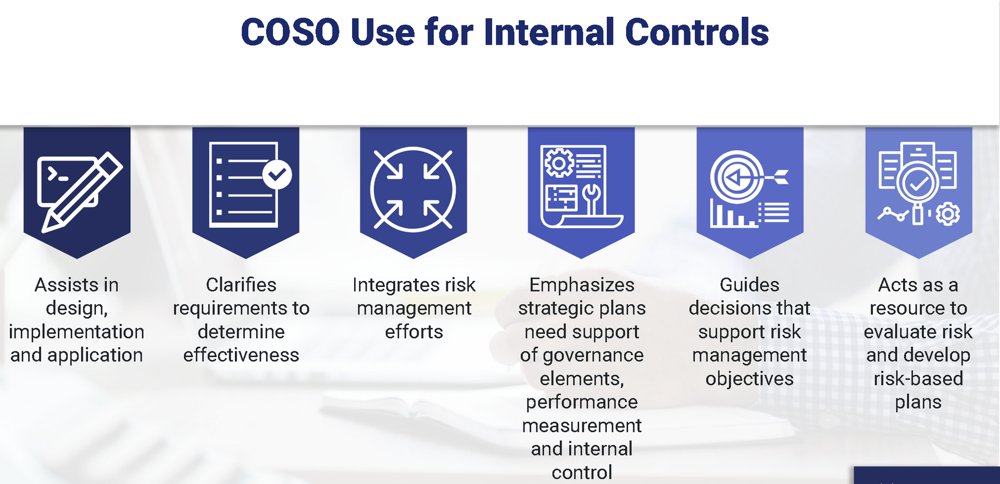

- [ ] Difference between ISO/IEC 2000/27000/31010

### Topic Summary

- Frameworks, Standards and guidance include best practices that an enterprise can use to address business issues through the efficient and effective governance and management of information and technology.
- Common standards and frameworks used in IT include ISACA's COBIT and Risk IT Framework, COSO Risk Management, ISO/IEC standards and NIST risk, security and privacy frameworks.
- Regardless of the framework, standard or guidance chosen, these should be tailored to the needs of the enterprise.

# Module 2, Topic 3: Risk-Based and Agile Audit Approaches

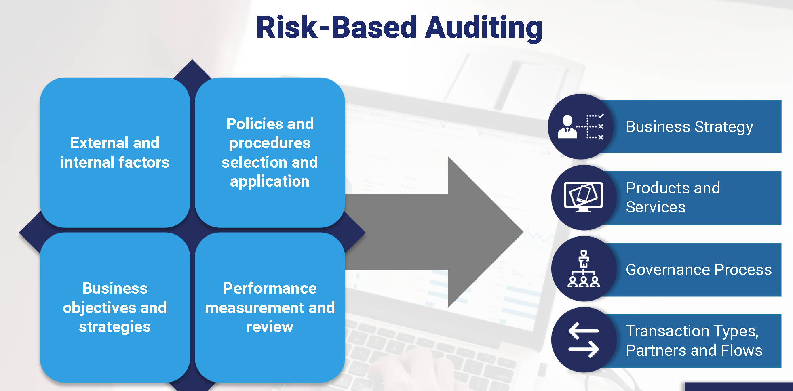

### Enterprise Risk Assessment Purpose

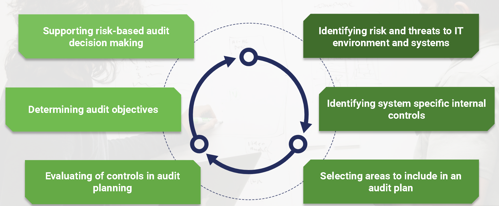

### Establishing Risk Criteria

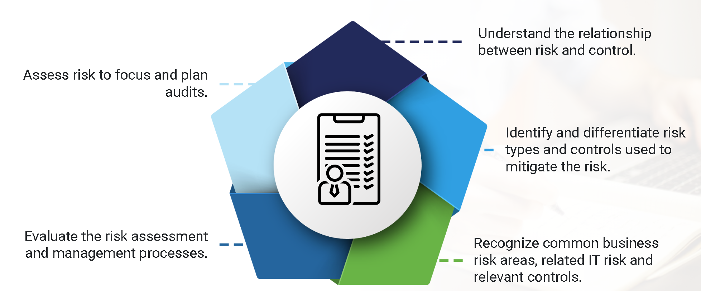

### IT-Related Risk Assessement

Meaningful IT-related risk assessments and risk-based decisions require:

- Expressing IT-related risk in clear and business-relevant terms.
- Involving major stakeholders to articulate impacts from adverse events.
- Understanding impact and resulting losses from IT-related issues.
- Considering effect on ability to deliver key products and services.
- Repearing regularly to remain relevant.

### Agile Audit Approach

> Applying an agile approach begins as a shift away from a static plan.

- PRIORITIZATION: Audit areas evaluated are picked based on risk. Timely inclusion of new risk or auditable areas allowed. Collaboration with stakeholders critical.
- SEGMENTATION: Breaking activities into fixed-length. Goal is to be quick and iterative instead of confined to a predetermined plan.
- COMMUNICATION: Embedding quality reviews and opportunities for staff questions as they come up.

### Audit Risk and Influences

- INHERENT RISK: Susceptibility of an audit area to an error that could be material.
- CONTROL RISK: Risk that a material error exists that would not be prevented or detected on a timely basis by the system of internal controls.
- DETECTION RISK: Risk that the IT audit will not detect an error that could be material, individually or in combination with other errors.
- OVERALL AUDIT RISK: Probability that information or financial reports may contain material errors. 

### Limiting Audit Risk

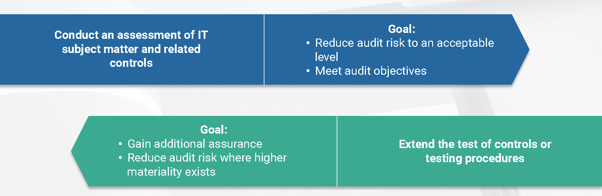

### Topic Summary

- A risk-based auditing approach provides the enterprise with feedback on whether its operational practices are aligned with its risk appetite.
- An agile approach to auditing is adaptable as audit expectations change, providing flexibility in the execution of an audit plan.
- Audit risk is the risk of reaching an incorrect conclusion based on audit findings drawn from collected information containing material errors that may go undetected during the audit.
- Audit risk can be reduced by conducting the appropriate assessments while planning and performing the IT audit and extending the control tests or procedures to gain additional assurance where higher materiality exists.

# Module 3, Topic 1: Audit Expectations

## Audit Process Phases

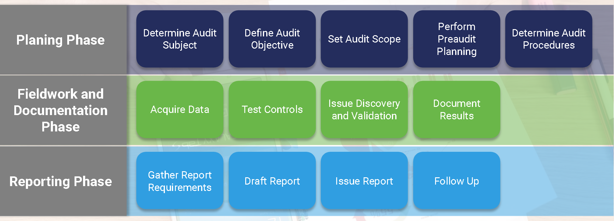

## Management Assertations

Board of Directors and senior management responsibilities:

- Confirming the enterprise has the appropriate IT resources.
- Implementing IT systems and controls.
- Ensuring IT sustains and extends enterprise strategies and objectives.
- Protecting the enterprise information resources.
- Ensuring the accuracy of information.
- Complying with applicable regulations.

> Senior Management makes assertations while meeting these responsibilities.

### Assertation:

- Formal declarations about the subject area written by management.
- List of specific attributes about the subject matter or related processes included.

### IT Auditors:

- Consider these assertations throughout the audit.
- Test their validity.
- Obtain assurance on their achievement.
- Address them in the audit report.

### Common Examples of Assertations:

- COMPLETENESS: Records all activities, information and other data that should have been recorded.
- ACCURACY: Amounts, dates and other data related to recorded activities were recorded appropriately.
- INTEGRITY: Information, evidence and other data received come from trustworthy, reliable sources and are protected throughout their life cycles.
- AVAILABILITY: Information, evidence and other data required for an audit exist and are readily accessible in the change management tracking application.
- COMPLIANCE: Information, evidence and other data are recorded according to the enterprise, regulatory or other applicable stipulations.
- EFFICIENCY: The level of performance used allows the lowest number of inputs to create the greatest number of outputs.
- EFFECTIVENESS: The desired output or objective is produced.
- CONFIDENTIALITY: Preserving authorized restrictions on access and disclosure.

### Assertion Availability and Quality

> Before an audit, an IT auditor should ensure:

- Management fully understands its responsibility to provide all required information.
- Assertations are consistent with good practice.
- Assertions are reviewed for an IT audit to confirm they are sufficient, valid, can be tested and relevant to the audit.

> If management cannot provide required information:

- Inform IT audit management and governance bodies of their identified issue.
- Postone the IT audit.
- Determine an appropriate course of action based on the level of risk if they do perform the IT audit.

## Auditor Expectations

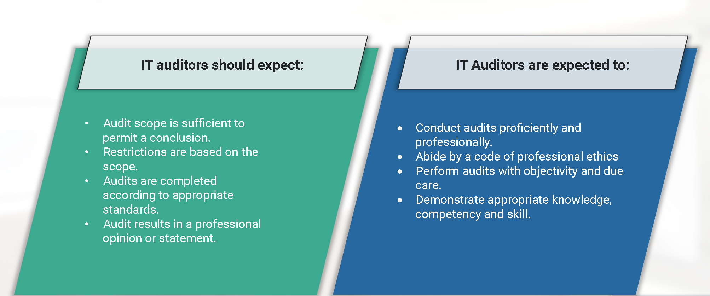

> Objectivity: The ability to exercise judgement, express opions and present recommendations with impartiality.

Impairment: Exists when either objectivity or independence is absent.

Examples of Impairment:

- Scope limitations
- Restrictions on access to records, personnel, equipment or facilities
- Resource limitations

> Fraud is the crime of using dishonest methods to take something valuable from a person or enterprise.

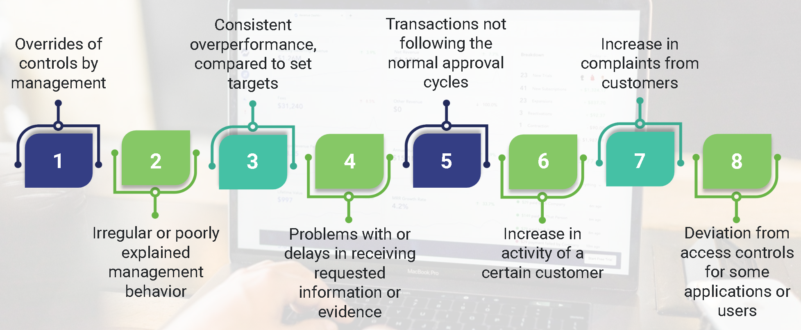

### Topic Summary

- The audit process phases are audit planning, fieldwork and documentation, and reporting and follow up. Each phase has distinct tasks to perform.
- Senior management provides assertations related to their subject area of responsiblity and are excpected to provide all required information regarding the subject matter and the assertions made.
- An IT auditor considers assertations provided by management throughout the execution of an IT Audit, tests their validity and obtains assurance on their achievement to addresses in the audit report.
- Auditors should expect to have a sufficiently defined scope and to perform their work in accordance with ethical standards and guidelines of the profession.
- During an audit, an IT auditor may encounter instances of fraud or criminal activity. It is crucial to understand the circumstances and the impact of this activity to determine the appropriate response.

# Module 3, Topic 2: Types of Audits

An IT auditor should understand the various types of internal and external audits and trhe basic audit procedures associated with each. Different types of audits performend by the audit function may include the following areas:

- IT
- Financial
- Operational
- Integrated
- Compliance
- Administrative
- Specialized

An IT audit is designed to evaluate whether internal controls implemented by management provide reasonable assurance that:

- Business, operational and control objectives are met.
- Undesired events will be quickly prevented or detected and corrected.

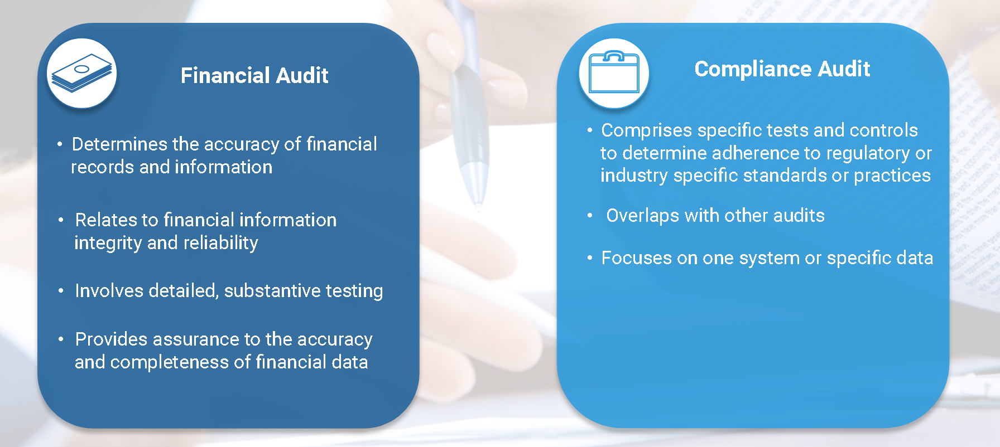

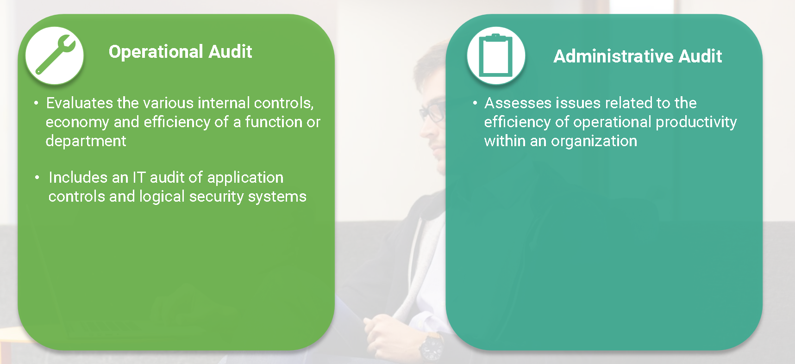

## What is an Integrated Audit?

> Process focused on risk whewre multiple appropriate audit disciplines are combined to assess key internal controls over an operation, process or entity.

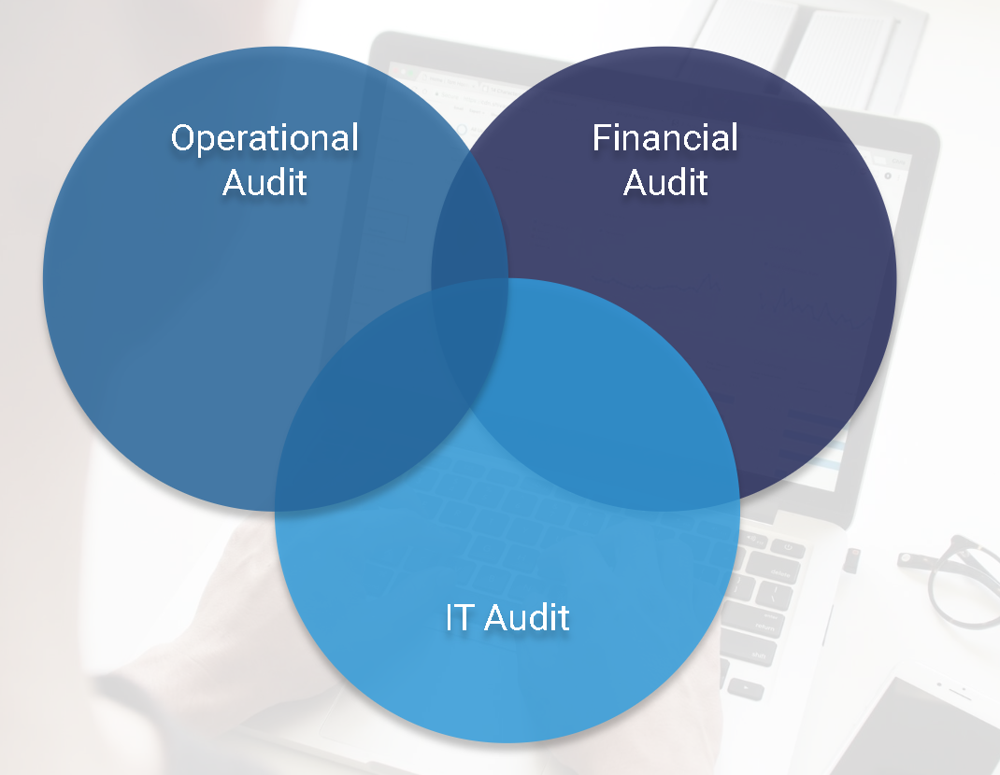

## Topic Summary

- An IT auditor should understand trhe various types of audits that can be performed, internally or externally, and the basic audit procedures associated with each type.
- There are many different types of specialized audits that can be conducted to evaluate third-parties and software or detect and investigate criminal acts or fraud.
- Integrated audits are risk-focused and combine multiple audit disciplines, such as financial, operational and IT audit procedures, to assess key internal controls over an operation, process or entity.

# Module 3, Topic 3: Specialized Assessments, Tests and Services

## Penetration Testing

Several types of penetration tests exist that may be employed, depending on the scope, objective and nature of the test.

- External Testing: Attacks and control circumvention attempts on the target's network perimeter from outside the target's system, usually the internet.
- Internal Testing: Attacks from within the network perimeter.
- Blind / Double Blind Testing: Penetration tester is provided with limited or no knowledge of the target. This test is expensive as the attacker needs to spend some time on researching the target. Effectively evaluates the incident handling and response capability of the target if the staff is not aware of the test.
- Targeted Testing: Both Target and Testers are aware of the test. Penetration testers are provided with information related to target and network design.
- Firewall Testing: A test of the reliability of firewall access controls. For this, obtain permission from top-level senior management prior to breaking into a live production system.

## Vulnerability 

A process of identifying and classifying vulnerabilities that provide a provide a careful examination of a target environment to discover any potential points of compromise or weakness.

Examples:

- Network Vulnerabilities
- Poorly designed or implemented web-facing services
- Untrained personnel
- Poor physical access controls
- Disruption of utilities
- Inefficient processes
- Insecure applications
- Unreliable supply chain
- Poorly maintained or old equipment

## Audit Report Opinion

- UNQUALIFIED: Auditor fully supports the findings with no modifications
- QUALIFIED: Auditor cannot express an unqualified opinion; however, the issues are not pervasive.
- ADVERSE: Auditor believes that there are material pervasive issues. Report readers should not rely on the service organization's system.
- DISCLAIMER: Auditor is unable to express an opinion because of insufficient evidence, and the possible effects could be both material and pervasive.

> When other than an unqualified opinion is presented, a separate paragraph describing the reasons for the opinion are provided in the report.

## Topic Summary

- An IT auditor often performs, assists or reviews specialized assessments and tests completed by experts in areas like cybersecurity or privacy.
- An IT auditor performs other nonaudit-related consultative and advisory services for the enterprise or clients in a particular area, providing an opinion on current performance and suggested improvements.
- Independent assurance performed by external third parties may be based a certification of compliance with an internationally recognized standard. This provides an enterprise increased confidence in specific activities or functions.

# Module 3, Topic 4: Audit Process - Planning

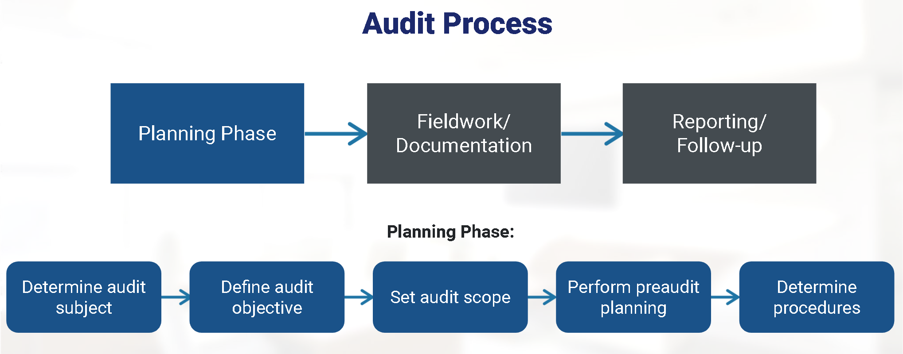

## Audit Schedules

An IT audit function establishes an overall strategic plan resulting in short-term and long-term audit schedules.

- SHORT TERM: Audits performed within the year.
- LONG TERM: Audits based on risk-related matters within enterprise IT environment performed in the future.

To effectively develop long-and short-term audit schedules, an IT auditor should:

- Comprehend the enterprise's mission, objectives, purpose and processes.
- Perform a risk assessment of areas subject to audit within the audit universe.
- Evaluate and consider available audit resources and capabilities.

## Audit Universe

> Definition: AUDIT UNIVERSE - Inventory of IT audit areas, compiled and matained to identify audits areas during the planning and execution of an audit.

- Includes and lists relevant processes, systems and units audited as part of an overall cycle of planned work.
- Serves as the source of an audit schedule.
- Reflects overall risk profile changes based on periodic adjustments.
- Drives enterprise operations management and assets.

## Individual Audit Planning

Individual audits require adequate planning.

- Determine Audit Subject
- Define Audit Objective
- Set Audit Scope
- Perform Preaudit Planning
- Determine Procedures

## Audit Criteria

... are the benchmarks used to measure and present the subject matter and against which an IT auditor evaluates the subject matter.

An IT auditor should consider selection of criteria carefully.

- Objectivity
- Reliability
- Completeness
- Measurability
- Relevance
- Understandability

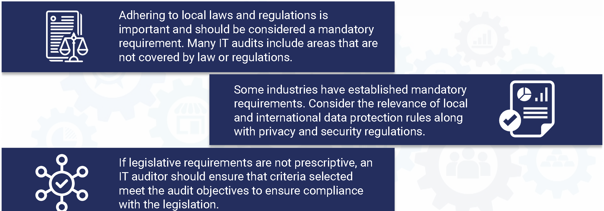

## Developing Audit Plans and Programs

After considering the selection of criteria, an IT auditor should have enough information to identify and select the audit approach or strategy and start developing the audit plans and programs.

The IT Auditor:

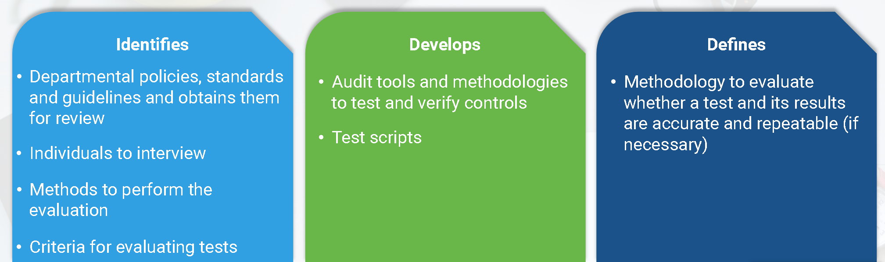

> Note: Audit Plans and Programs are often used interchangeably.

## Audit Plans and Topics

Examples of GENERAL and SPECIFIC Topics:

|General|Specific|
|----|-----|
|Budget | Identification of tools needed |
| Resource availability / allocation | Assessment criteria |
| Schedule dates | Risk assessment documentation |
| Type of report | Reporting requirements / distribution |
| Intended audience | External reports available |
| Deliverables | Reports requested |

## System Information Flows

Example: Invcoice Payment Process Flowchart

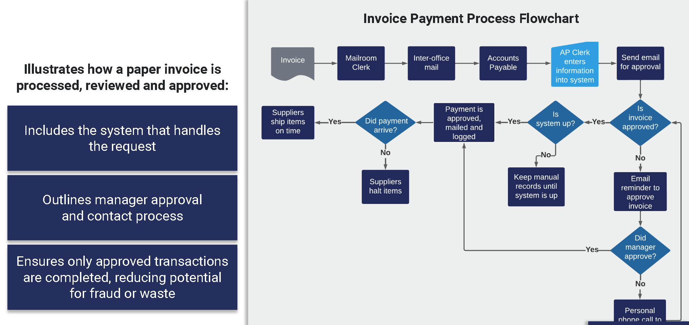

> Definition AUDIT PROGRAM: A granular description of the planned work to meet the audit objectives.

## General Audit Procedures

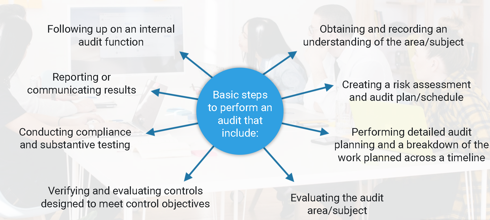

## Topic Summary

- Overall IT audit planning includes the entire IT audit function.
- Individual audit planning relates to individual engagements and may impact or be impacted by overall audit plans.
- Planning guides the process of building the audit program that outlines the audit subject, objectives, scope, schedule, procedures and criteria used to assess IT systems.
- IT auditors must understand the business and its goals, while demonstrating proficiency in knowledge and skills, to effectively perform their tasks.

# Module 3, Topic 5: Audit Fieldwork

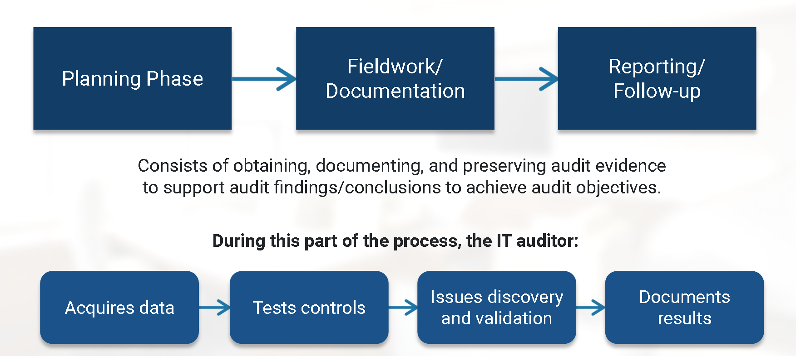

## Entrance Meeting

This is essentially a kick-off meeting. It is advisable to include senior management in the entrance meeting.

Things to consider for the IT Auditor in this meeting:

- Finalize the audit scope.
- Clarify and collaborate with management on special concerns or underlying business issues within scope.
- Set milestone and schedule dates for the audit.
- Explain the methodology of the audit.
- Identify points of contact for each team.
- Describe expectations for management (audit timeline, report and ratings).

## Auditing Policies

IT controls should flow from the enterprise's policies, and an IT auditor should use policies as a benchmark for evaluating compliance.

- Understand that policies are part of the audit scope and tested for compliance.
- Identify and Report policies that hinder the achievement of business objectives for improvement.
- Consider the extent that policies apply to third parties or outsourcers, their extent of compliance with the policies, and whether their policies conflict with the enterprise's policies.

## Evaluating Policies and Procedures

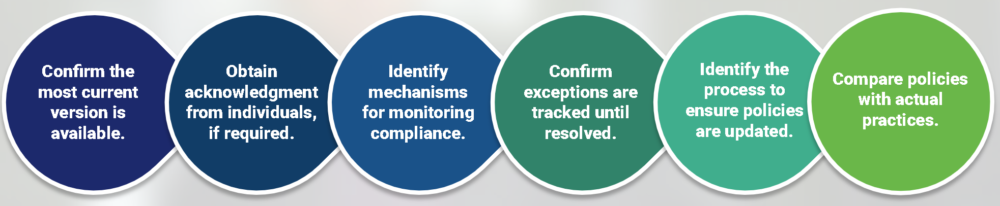

## Seperation of Duties (SoD) Control Matrix

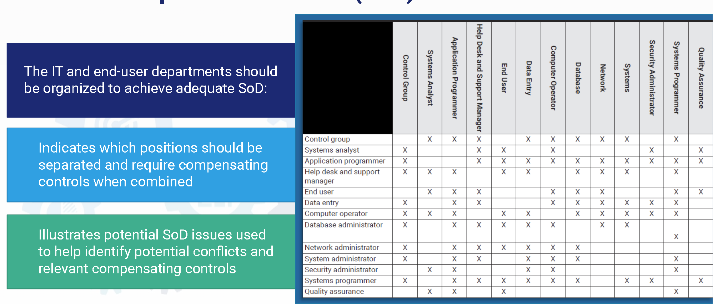

## Topic Summary

-Audit process should be documented with descriptons of the audit work performed and the audit evidence that supports the IT auditor's findings and conclusions.
- An IT auditor should ensure that audit findings and conclusions are supported by appropriate analysis and interpretations of evidence.
- Some of the common areas of concern related to an IT audit include standards, policies, procedures, separation of duties, identity access management and change management.
- Reviewing these common areas of concern is an important part of an IT auditor's role in documenting evidence as a part of audit fieldwork.

# Module 3, Topic 6: Audit Evidence

## What is Audit Evidence?

During an IT audit, an IT auditor obtains sufficient, reliable and relevant evidence to achieve the audit objectives.

- SUFFICIENT: Adequate, convicing and leads another IT auditor to form the same conclusion.
- RELIABLE: Valid, factual, objective and supportable.
- RELEVANT: Focused on the objective of the audit, not peripheral issues or nature of evidence gathered.

## Types of Audit Evidence

- Observed processes and physical items existance (Network security monitoring system, Inventory of Media in an offsite storage location)
- Documentary evidence (written policies and procedures, Results of data extractions, records of transactions, program listings, external confirmation from 3rd parties)
- Results of audit test procedures and analysis (benchmarking IT performance against other enterprises or past periods, repeating processes or controls)
- Representations (written statements by management, verbal representations of how a process works)

> When gathering evidence, an IT auditor should consider:

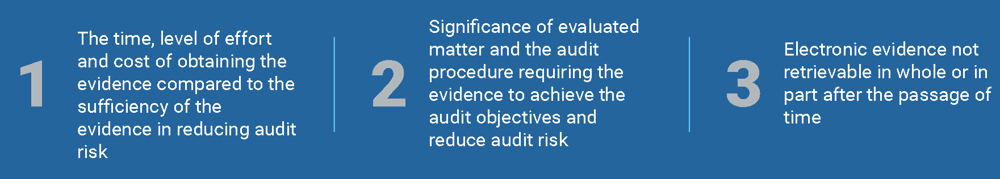

## Audit Evidence Collection Procedures

## Generalized Audit Software

Generalized audit software (GAS) is a multipurpose audit software used for general processes such as record selection, matching, recalculation and reporting.

- Refers to standard software with the capability to directly read and access data from various database platforms, flat-file systems and formats.
- Provides an IT auditor with an independent means to gain access to data for analysis and the ablity to use high-level, problem-solving software to invoke functions performed on data files.

## Computer-Assisted Audit Techniques

> A computer-assisted audit techniques (CAAT) is any automated audit technique such as generalized audit software (GAS), test data generators, computerized audit programs and specialized audit utlilities.

## Workpaper Standards

Audit workpapers should be:

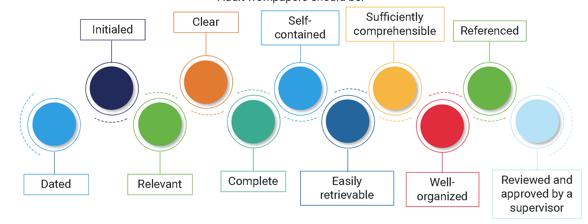

## Accessing Production Data

An IT auditor should know the following before manipulating production system data:

- When requesting access to production data to use withCAATs, an IT auditor should request read-only access.
- IT auditors should manipulate data on copies of production files in a controlled environment to ensure that production data are not exposed to unauthorized updating.
- Most CAATs allow for production data to be downloaded from production systems to a stand-alone platform and analyzed from the standalone platform, thereby insulating the production systems from any adverse impact.

## Test Data

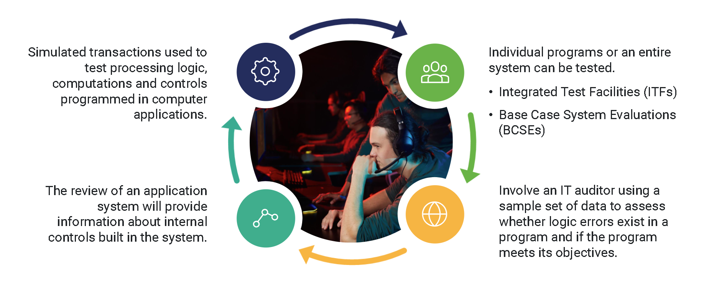

## Data Collection and Analysis Processes

The process used to collect and analyze data includes multiple elements.

- Setting the scope by determining audit/review objectives; defining data needs, sources and reliablity.
- Identifying and obtaining the data
- Validating the data by determining whether the data are sufficient and reliable
- Executing the tests, running scripts and performing other analytical tests
- Documenting the results by recording the testing purpose, data sources and conclusions reached.
- Reviewing the results by ensuring that the testing procedures were adequately performed and reviewed by a qualified person.
- Retaining the results or maintaining important test elements.

## Topic Summary

- Gathering evidence is a critical part of audit fieldwork performed manually or by automated methods.
- Audit evidence should be relevant to identified scope and allow another auditor of similiar proficiency to draw similiar conclusions.
- Evidence is obtained from the responsible party, validated, tested and documented for analysis for reporting.
- Automated audit tools allow IT auditors to quickly collect evidence independently across systems with different hardware and software environments, data structures, record formats or processing functions.
- Data analytics help IT auditors to select and analyze full data sets to continuously audit or monitor key enterprise data for abnormalities or variances to determine effectiveness or identify errors.

# Module 3, Topic 7: Audit Reporting and Remediation

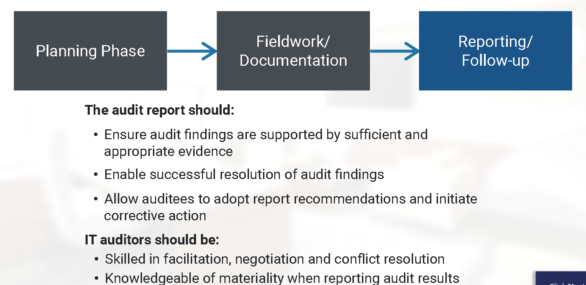

## Report Objectives

- Formally presenting the audit results to the auditee or audit client (if different)
- Serving as formal closure of the audit
- Providing statements of assurance, areas that require corrective action and related recommendations.
- Serving as a valued reference for any party researching the auditee or audit topic.
- Serving as the basis for a follow-up audit if audit findings were presented.
- Promoting audit credibility with a well-developered and well-written report.

## Reporting Structure

Audit reports are the end product of the IT audit work. Formats vary by enterprise. IT auditors should understand the basic components of an audit report and how it communicates audit findings to management. Audit reports usually have a standard structure and content.

- Report Introduction (Audit Objectives, Scope, subject or activity, ...)
- Audit Findings (Included in separate sections, grouped by materiality or intended recipient)
- Conclusion and Opinion (Adequacy of controls and procedures examined and potential risk identified)
- Reservations or Qualifications (Adequacy of controls and procedures, balance of report supports conclusion, Evidence gathered during the audit should support the audit conclusions)
- Detailed Audit Findings (should be based on materiality about the findings and intended recipient)
- Auditee Management Responses (.. may present corrective actions taken; evaluate recommendations and decide to accept the risk)

## Describing Findings

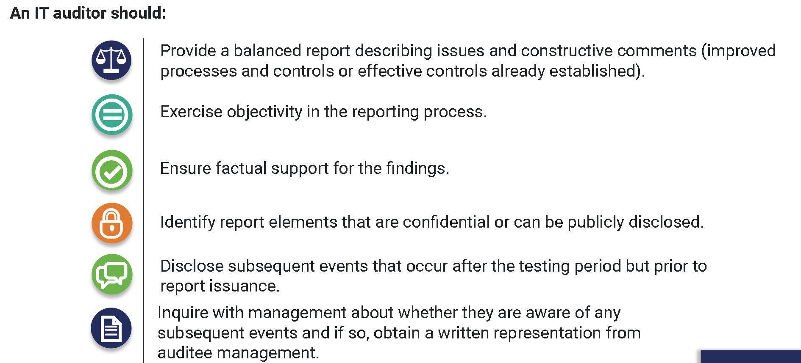

An audit report is:

- Issued to management of the group or subject audited.
- Shared with audit committee of the board of directors and enterprise's external audit firm.

Reports should be:

- Tailored to the audience, excluding irrelevant details.
- Presented from a business perspective.

## IT Remediation

Audit remediations is the final stage when an IT auditor confirms that auditee management took corrective action identified in the audit report.

If auditee management accepted the risk of not taking corrective action, an IT auditor documents and reports that fact.

IT auditors will follow up to ensure:

- Recommendations were addressed.
- Corrective actions were completed.
- Risk was accepted.

## Topic Summary

Audit reporting is when the auditor presents their findings and recommendations.

- The audit report can act as the end of the engagement or lead to monitoring follow-up items through remediation.
- Management receives the report and decides whether to implement the recommended action items or accept the risk presented.
- When performing follow-up on remediation items, the IT auditor should know key elements (number of findings, criticality, time frame and complexity).

# Module 4, Topic 1: Traditional IT Infrastructure

## Hardware 

Some areas of concern regarding Hardware to an IT auditor are:

- Obsolescence
- EOL Disposal
- Poor maintenance
- Misconfiguration
- Lack of documentation
- Loss or theft
- Data loss due to insecure disposal
- Sniffing (capturing traffic)
- Physical access
- Use without authorization

When reviewing hardware an IT auditor should review:

- Hardware acquisition plan and process
- IT (hardware) asset management
- Capacity management and monitoring
- Preventive maintenance schedule
- Hardware availability and utilization reports
- Problem logs and job accounting system reports

## Software

Some areas of concern regarding Software to an IT auditor are:

- Logic Flaws
- Bugs (Semantic Errors)
- Loss of Source Code
- Lack of Patching
- Disclosure of Sensitive Information
- Improper Modification of Information
- Lack of Access or Version Control
- Lack of Input and Output Validation

## Source Code

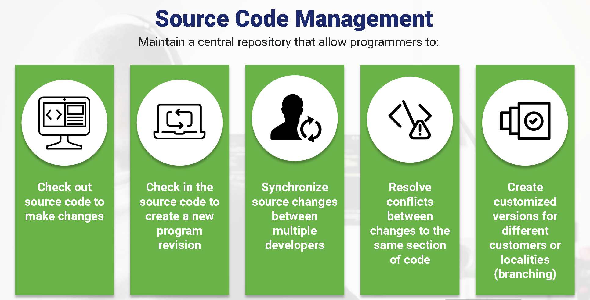

An IT Auditor should consider a few questions when reviewing source code, including:

- Who has access to the source code?
- Who can commit the code?
- Is there an alignment of program source code with program objects?
- Is there an alignment with change and release management?
- Are there backups of source code and escrow agreements?

## Database Management System

A database management system (DBMS) provides the facility to create and maintain a well-organized database to:

- DBMS data are organized in multilevel schemes with basic data elements (fields) at the lowest level.
- Levels above each field have different properties depending on the database architecture
- The DBMS can include a data dictionary that identifies the fields, their characteristics and use.
- Active data dictionaries require entries for all data elements and assist application processing of data elements.
- Passive dictionaries are only a repository of information that can be viewed or printed.

## DBMS Security Features

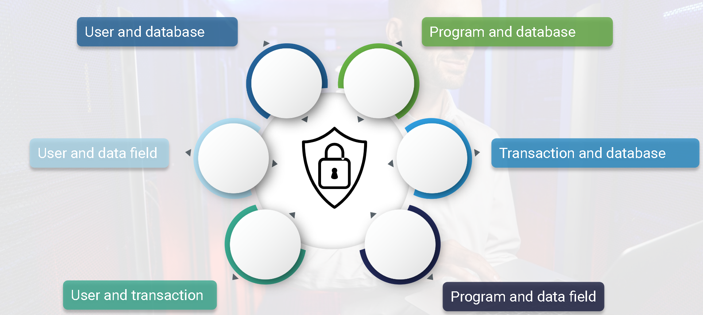

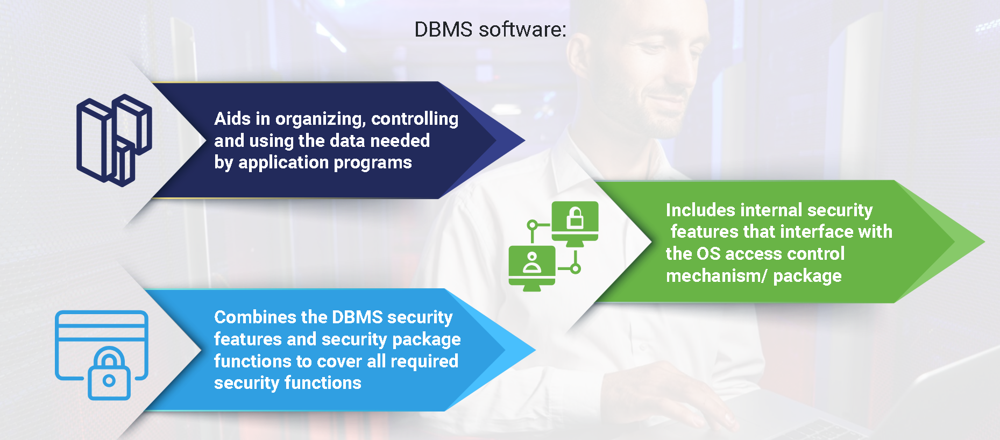

## Database Structures

Three major types of databases exist:

### Hierarchical

> Hierarchy of parent and child data segments created by relationships.

- One to many (1:N) mappings between record types represented by logical trees.

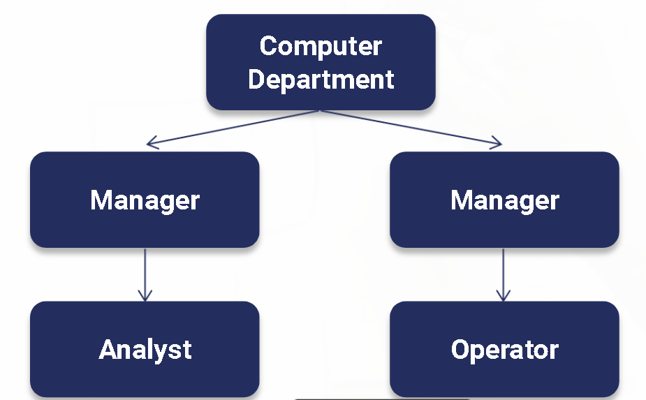

### Network

> Set: Basic data set modeling construct formed by an owner record type, member record type and name.

- Allows a multi-owner relationship
- Can be a member or owner in another set
- Usually one to many (1:N) but can be one to one (1:1)
- Can be complex and difficult to comprehend, modify or reconstruct
- Is rarely used in current environments
- Does not support high-level queries
- Requires user programs to navigate data structures

### Relational

> Based on set theory and relational calculations

- It allows the definition of data structures, storage/retrieval operations and integrity constraints.
- Data and relationships among these data are organized in tables.
- A table is a collection of rows (tuples) that contain the same columns.
- Columns correspond to fields.
- Tuples are equal to records in a conventional file structure.
- Relational databases are used in most common ERP systems.
- Common relational database management systems (RDBMS) include Oracle, IBM, DB2 and Microsoft SQL Server

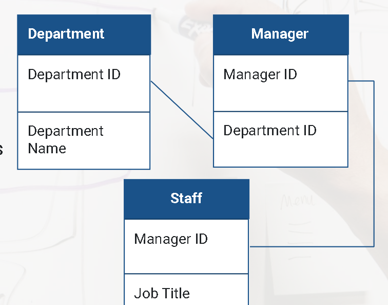

## Data Elements

Data elements to define a database are called metadata. This includes data about data elements to define:

- Logcial and Physical Fields
- Files
- Data Relationships
- Queries

Types:

- Conceptual Schema
- External Schema
- Internal Schema

> If the schemas (database configurations) are not adjusted to smoothly work together, the DBMS may not be adequate to meet the user's needs.

## Database Controls

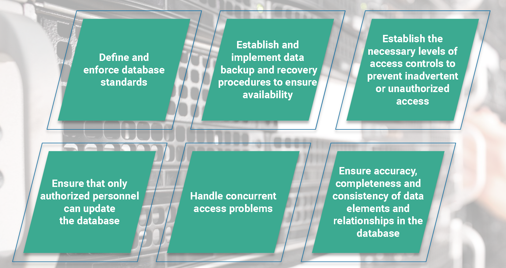

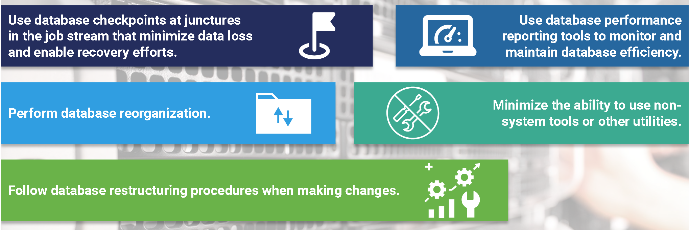

## Database Summary statements

> A RELATIONAL DATABASE supports many relationships.

> A HIERARCHICAL DATABASE is based on parent and child data segments.

> A NETWORK DATABASE has a basic modeling construct with 1:N relationships.

## Database Reviews

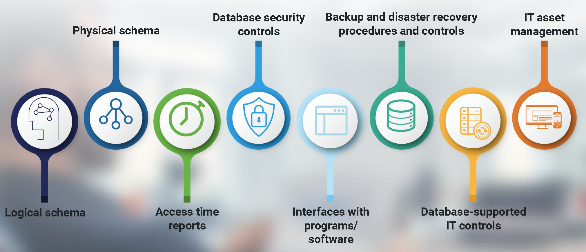

## Protecting Databases

Databases contain critcal and sensitive information required to support business operations.

Databases are vulnerable to multiple types of risk, including:

- Unauthorized activity by authorized users
- Malware infections or interactions
- Capacity issues
- Physical damage
- Design flaws
- Data corruption
- Use of weak, unenforced or default passwords
- Use of generic or default accounts by database administrators

Database Security covers a wide range of information security controls.

The Security areas that need to be addressed are:

- Application Control
- Authentication Types
- Default configurations
- Password parameters
- Access controls
- Roles and privileges
- Audit trails
- Recording
- Log management
- Encryption
- Encryption level

## Topic Summary

- A strong knowledge of the various IT environment components and systems and their areas of concern will help an IT auditor perform their role effectively.
- Hardware are the physical components of a computer system and compromise the equipment and devices  that process, store and transmit data.
- Software provides an interface to hardware and processes transactions on behalf of the user.
- A DBMS helps to organize, control and use the data needed by application programs and controls user access at multiple levels.

# Module 4, Topic 2: Cloud Computing

## Cloud Service Delivery Models

Specifies the capabilities offered to users and the applications supported. Each model offers a distinct computing service.

- Software as a Service (SaaS)
- Platform as a Service (PaaS)
- Infrastructure as a Service (IaaS)

## Cloud Deployment Models

Four cloud deployment models exist:

- PUBLIC CLOUD: Offering from one cloud provider (CSP) to many clients concurrently sharing ressources.
- PRIVATE CLOUD: Consists of one client (individual or enterprise).
- COMMUNITY CLOUD: Private-Public cloud with clients have a common connection or affiliation (e. g. trade association, industry or locality.)
- HYBRID: Combination of two or more of the other cloud model types.

## Essential Characteristics

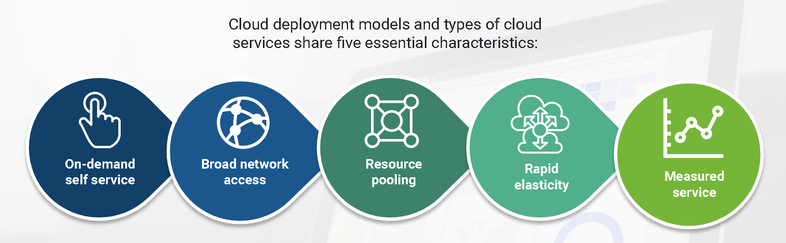

## Cloud Security and Risk

Enterprises deploying cloud technology still need to meet security requirements required by the business, including:

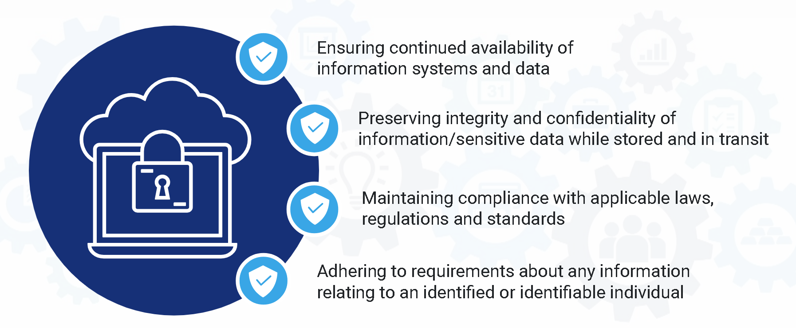

An IT Auditor should be familiar with the risk associated with cloud computing and associated controls.

## Cloud Environment Audit Considerations

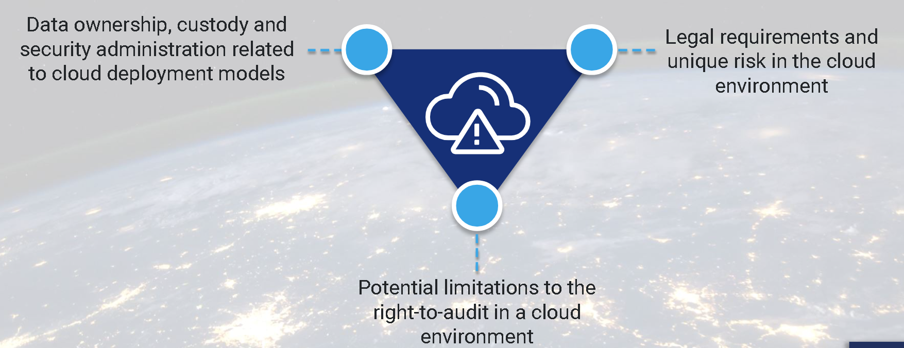

