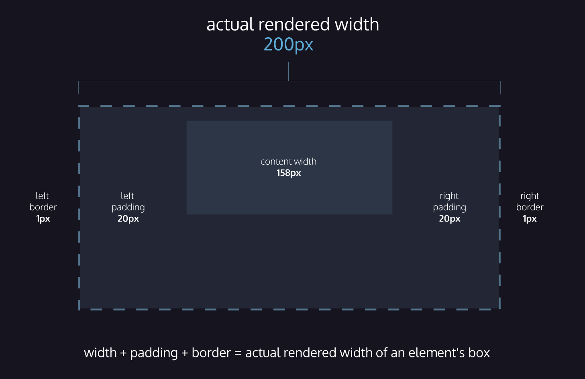
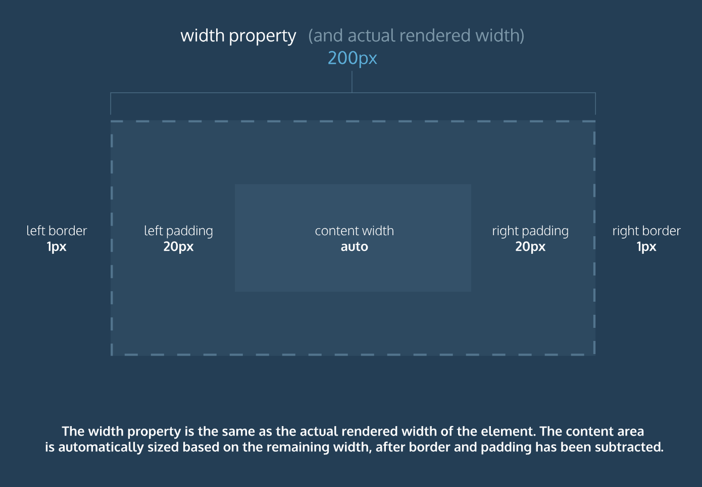

# Module 06: The Box Model

## Vertical Margins Collapse

# Module 07: Changing the Box Model

## Box Model: Content-Box

Many properties in CSS have a default value and don’t have to be explicitly set in the stylesheet.

For example, the default font-weight of text is normal, but this property-value pair is not typically specified in a stylesheet.

The same can be said about the box model that browsers assume. In CSS, the box-sizing property controls the type of box model the browser should use when interpreting a web page.

The default value of this property is content-box. This is the same box model that is affected by border thickness and padding.

> Study the diagram below. It illustrates the default box model used by the browser, content-box.

## Box Model: Border Box

Fortunately, we can reset the entire box model and specify a new one: border-box.

> Study the diagram below. It illustrates the border-box model from the code above. Pay attention to how the total width (200px) and the padding affect the content width of the element.

