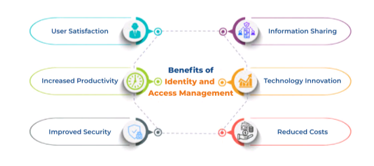
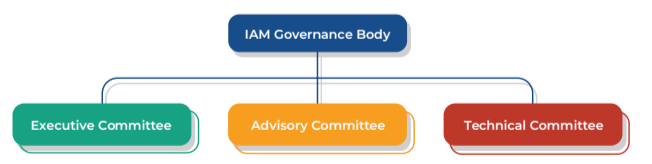
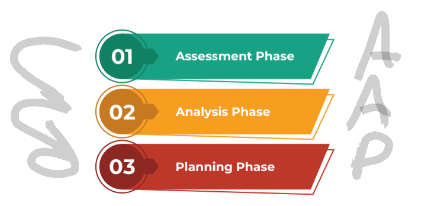

# CIAM Study Notes

# CRD 1 Strategy and Governance

## Table of Contents

1. [IAM Overview](#iam-overview)
2. [Identity Types](#identity-types)
3. [IAM Benefits](#iam-benefits)
4. [Identity Management Governance](#identity-management-governance)
5. [Guideline Summary](#guideline-summary)

## IAM Overview

<strong>Identity and Access Management (IAM)</strong> is the information security discipline which is concerned with user and device access to an organization's resources. It refers to a set of business processes and technologies that support the creation, maintenance and deactivation of a digital identity and related access rights.

> As organizations better understand and embrace IAM, they know how an effective identity management program with entitlement management and enforcement of logical access controls can help them achieve benefits, such as low operating costs derived from centralization, automation, as well as effective and efficient processes to address delayed processing, high costs associated with access provisioning or de-provisioning, excessive access and compliance challenges.

Benefits include:

- Leverage technology to automate
- Address system access in a coherent manner across the enterprise
- Realize higher return on investment
- Reach business goals
- Meet user and compliance demands
- Make processes more efficient
- Reduce risks

### Key Terms and Concepts

- <strong>Identity</strong> - is comprised of unique elements that describe a person or machine. An identity is recognized by a system in many ways including with something the user knows, such as a password or a personal identification number (PIN); something the user has, such as an ID card, key fob or a badge; and something the user is, such as a fingerprint or retinal pattern; or any combination of these elements.
- <strong>Access</strong> - is the information representing the rights that an identity is granted.
- <strong>Entitlements</strong> - is the collection of access rights.

The concept of identity and access management refers to human identity, as well as machine identities, service accounts and other non-human identities that must be managed.

For identities to become part of an organization and access management cycle, they need to pass through several stages which include:

<strong>1. Provisioning</strong> - Creation, Change, Termination, Validation, Approval, Propagation and Communication. 
<strong>2. Identity Management</strong> - refers to ongoing companywide activities including the establishment of an IAM strategy, administration of IAM policy statement, changes, establishment of identity and password parameters, management of manual or automated IAM systems and processes and periodic monitoring, auditing, reconciliation and reporting of IAM systems. 
<strong>3. Enforcement</strong> - refers to authN, authZ and logging of identities as they are used within the organization's IT systems though (primarily) automated processes or mechanisms. 

### Additional Terms and Concepts

- <strong>Access Management</strong> - The proccesses associated with a user's login across a realm of applications or information repositories.
- <strong>Authentication</strong> - The process of validating that people or entities are who they say they are.
- <strong>Authorization</strong> - The process of determining if a user has the right to access a service or perform an action.
- <strong>Single Sign-On</strong> - A central authN protocol that allows users to log-on once and access all systems and data for which they have AuthZ.
- <strong>Credential</strong> - An Item such as a username/password combination.
- <strong>Directory Service</strong> - Software System that stores, organizes and provides access to information in a directory for entities such as people, groups, devices, resources, etc.
- <strong>Federation</strong> - Technical Implementation that enables identity information to be developed and shared among several entities and across trusted domains. Also known as Federated Identity Management.
- <strong>Governance</strong> - Processes, tools and people which allow organizations to manage user identities and their access while meeting compliance and managing risks.
- <strong>Identity Management (IdM)</strong> - The processes and solutions that provide for the creation and management of user information also known as IdM.
- <strong>Identity Provider (IdP)</strong> - System that validates the identity of a user in a federated system. The service provider (or SP) uses the IdP to get the identity of the current user.
- <strong>Identity Store</strong> - Underlying information associated with users and stored across a variety of technologies including databases, LDAP, Active Directory, text files etc.
- <strong> Access Administrator</strong> - A person who assigns roles, group memberships and/or other attributes to a user.
- <strong>Service Provider (SP) </strong> - A resource or system that provides a generic service to the user in a federated system. To users, a service provider is the same thing as the application they are trying to use.
- <strong>User</strong> - A term used to generalize and reference multiple entities which access a system such as employees, guests, application users and external users such as customers, contractors and vendors.

## Identity Types

Identities take many forms within an organization.

- Employees and contractors
- Customers
- Vendors
- IT devices
- Application Service Accounts (e. g. pre-defined functions within an application)
- Machine Accounts (e. g. IT hardware devices)
- Functional or batch accounts

When auditing the identities present in the organization, we should determine whether specific and universally applied identifiers are associated with each identity type.

## IAM Benefits

The Identity and access management models may also include a central identity database which stores the necessary information about identities and their attributes to be used by all systems for access management.

If implemented correctly, an identity and access management program will provide the following benefits:

> 1. Increased Productivity

Centralization and automation of shared identity and access management processes across the organization will improve the identity and access lifecylce.

Overall, IAM services will improve user experience with efficient access provisioning processes which will improve access to resources and physical locations with little to no intervention by the IT staff.

> 2. User Satisfaction

IAM processes applied consistently will eliminate confusion over the steps needed to grant and manage access which will increase user satisfaction. 

The IAM Program will reduce complexity of the processes for end users, application owners and system administrators. It will eliminate paper-based processes and manual processes as much as possible. Automation will allow end users to have insight over their accounts and control basic request through self-service such resets.

If implemented correctly, identity and access managfement should be simpole and intuitive to an end user.

> 3. Information Sharing

An IAM program can facilitate collaboration and information sharing among business units and applications. It breaks down barriers to access for end users and enable federated access to external systems. 

IAM can provide the organization with a competitive advantage over competitors that cannot offer the same level of ease and expediency enticing customers, employees and related parties to collaborate with the organization.

> 4. Reduced Costs

Greatly enhanced IAM services can reduce operating costs. Federation Services eliminate the need for local identities for external users, thus simplifying application administration. 

> 5. Improved Security

Properly implemented IAM solutions help enable proactive security risk identification and mitigation, allowing the organization to identify policy violations or remove inappropriate access privileges without having to waste time and effort searching across disparate systems.

Typical enterprise IAM management scenarios include:

- Password Sync with single sign-on and self-service requests and password reset.
- Automated provisioning, access deactivation, approvals and reporting.

> 6. Technological Innovation

IAM increases the agility of application development and deployment by eliminating the need for application developers to reinvent and duplicate potentially vulnerable authN systems or manage multiple systems redundantly.

### Impact of Poor IAM

- 1. <strong>Reduced User Productivty</strong> - New users may become less productive as they wait for accounts to be created.
- 2. <strong>Poor User Experience</strong> - Delays and multiple accounts and passwords to support access to distributed systems accross the organization may result in user confusion and frustration.
- 3. <strong>Limited Information Sharing Across Applications</strong> - Lack of System integration can lead to applications not being able to share information.
- 4. <strong>Increased Overhead</strong> - The high volume of calls to the IT Help Desk to address basic account issues such as password management.
- 5. <strong>Reduced Security</strong> - The inability to grant or remove access on a timely basis potentially exposes the organization to unauthorized access and non-compliance issues.

## Identity Management Governance

Identity and access management governance refers to a set of people, technologies and processes used to consistently manage inforation about users and their access in an organization.

### Goverance Structure

> 1. Executive Commitee Objectives

- Guide and approve
- Provide strategic priorities and approve the program including policies
- Identify and assist in the resolution of obstacles
- Provide direction for communication to stakeholders
- Track the status of the projects and assist with risk mitigation
- Monitor ongoing impact, service levels and service improvements

> 2. Advisory Commitee Objectives

- Participate in improving the IAM lifecycle and user experience
- Help improve IAM processes
- Recommend improvements
- Advise on strategic plan and facilitate decisions
- Recommend implementation approaches and help communicate benefits and challengers

> 3. Technical Committee Objectives

- Make technical recommendations to the Executive Committee
- Identify the need for technical solutions, architectures and standards
- Recommend external resources
- Manage technical changes to ensure that changes are includes in planning

### Strategic Planning

> In order for the IAM program to successfully meet it's objectives, the various teams must follow a "top-down" delivery approach. The strategic plan will service as the governing document, and all activities will be planned and managed accordingly.

An IAM strategy should address three distinct phases: Assessment, analysis and planning.

> 1. Assessment Phase

Based on business drives and goals, organizations must assess their current infrastructure and architecture, as well as identity management processes.

> 2. Analysis Phase

To determine the technology and process gaps:

- Identity needed identity management capabilites and integration points.
- Identity and prioritize potential identity management initiatives.

> 3. Planning Phase

- Define a high-level future state identity architecture by developing a phased implementation roadmap and documenting a final report with recommendations.
- When strategic planning is complete, have a thorough understanding of identity management challenges and opportunities that your organization faces.

### Strategic Objectives

- Simplify the User Experience (KISS Principle)
- Enable Collaboration (Keep Collaboration in mind)
- Protect Resources (Improve security by working with Standards)
- Facilitate Technology Innovation (Establish a strong foundation for IAM to manage user access regardless of new technological disruptions)

### Strategic Planning Benefits

Some of the benefits of strategic planning include:

- Shared Identity Management Vision that crosses technical and business boundaries.
- Knowing exactly what technology and process gaps you need to fill to reach your IAM goals.
- Having a detailed, actionable plan.
- Keeping your implementation services costs at a minimum by increasing the likelihood of a successful outcome.
- Saving time, money and management efforts by ensuring critical implentation success factors are in place.
- Making sure you incorporate industry best practices into your strategy, design and implentation plans.
- Transferring knowledge across your team members.
- Discovering and mitigating potential risks.
- Identifying improvement opportunities.

## Guideline Summary

Below is a list of guidelines to consider during the IAM strategy planning and governance:

- Develop a strategy that is aligned to the needs of the business and considers people, processes and technology issues.
- Consider IAM as a hybrid of IT and business solutions to meet enterprise goals including regulatory compliance and risk management.
- Use a risk-based approach to implementation, to ease the integration and adoption of IAM changes.
- Consider all business and process transformation requirements before selecting a tool.
- Create an inventory of applications, systems and roles.
- Be prepared to meet concerns and objections during the transformation period.

