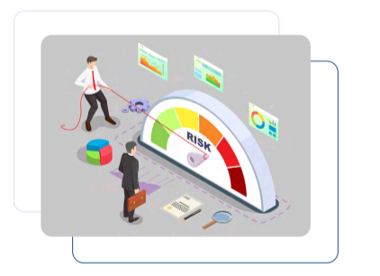

# CRD 2 Program Management

## Table of Contents

1. [IAM Risk Management](#iam-risk-management)
2. [Program Delivery](#program-delivery)

## IAM Risk Management

Risk management is an important aspect of identity and access management (IAM) and must be considered in IAM program management because it helps organizations identify, evaluate and mitigate potential security risks related to user access, to systems and data.  

Some key risk management strategies in IAM include: 

- Conducting regular access reviews
- Implementing strong authN and authZ mechanisms
- Limiting user privileges to only those required for their job function
- Monitoring and analysing access logs to detect and investigate any suspicious activity
- Developing and implementing a comprehensive incident response plan

## Program Delivery

An IAM program must implement deliverables in accordance with four strategic objectives.

- Simplify the User Experience
- Enable Collaboration
- Protect Resources
- Facilitate Technology