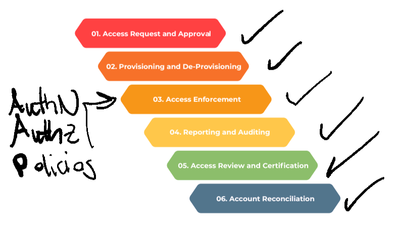

# CRD 3 Lifecycle and Transformation

## Table of Contents

1. [Lifecycle Challenges](#lifecycle-challenges)
2. [Lifecycle Transformation](#lifecycle-transformation)
3. [Strategy and Governance](#strategy-and-governance)

## Lifecycle Challenges

The following section depicts the objectives and challenges associated with each of the six IAM lifecycle phases.

### 1. Access Request and Approval

Granting accuratre and complete access on a timely basis is critical for organizations to be productive. Some of the challenges associated with this phase include:

- Inconsitent processes by country, system, business units and resources.
- Insufficient understanding of access needs for approval in decision making.
- Inefficient and often unclear process for requesting access.

### 2. Provisining and De-Provisioning

One of the major goals of the IAM lifecycle phase is to grant users the appropiate entitlements and access rights, and revoke their access in a timely manner. However, manual processes, access closing to imrprove processing speed, incomplete job descriptions, and delayed communication when users leave the organization or change jobs internally, and decentralized systems create challenges.

### 3. Access Enforcement

Access enforcement occurs through policies, authentication and authorization. Challenges associated with this phase include lack of policies, segregation of duties and centralized repository of identity information or single sign-on, and inconsistent access controls.

### 4. Reporting and Auditing

Reporting and auditing consists of defining business-relevant key performance indicators (KPIs) and metrics, and auditing user access. Common challenges associated with this phase include lack of metrics indicators which align with the business goals and lack of resources or adequate budgets for audits.

### 5. Access Review and Certification

Reviewing user access periodically is necessary to validate the appropiateness of given access based on the user role or function. This task can be challenging because of inconsistent processes, distributed nature of systems under review and lack of reviewer knowledge about user's job function and required access.

### 6. Account Reconciliation

Periodic or automated account reconciliation is needed to match access to the original request and enforce access, however, the lack of centralized repository of identity information make it difficult and inefficient to complete this task.

IAM processes and methodologies should not be the only controls used to prevent user identities from having inappropiate access. The organization should incorporate a method for verifying or reconciling user identities and their corresponding access rights wiuth the actual access rights for which these identities were originally approved. This reconciliation process may reveal some of the following:

- User identities possess access rights that match the rights that were approved.
- User identities did not have their access rights reviewed and approved as frequently as expected.
- User identities possess access rights that do not match the rights that were approved.
- User identities associated with terminated or deactivated users still reside in the IT environment.
- Users who need to be issued identities and granted access rights did not have access requested or approved.
- Inactive or orphaned accounts exist.

If the verification and reconciliation process reveals identities and access rights that are misaligned, the organization should have a process to report these problems, determine any corrective actions, and acquire necessary approvals to correct these deficiencies.

## Lifecycle Transformation

> The success of an IAM Transformation depends on the interaction of people, processes and technology. Below you will find some key transformation concepts to consider.

### People

- Using a <strong>risk-based and business-centric approach</strong>, consider the downstream impact on an organization's structure, as well as on key stakeholders.
- Avoid confusion over priorities by appointing one executive-level <strong>"program owner"</strong> who is empowered to make decisions as required.
- Be proactive in establishing ongoing support by designating an experienced operational manager as the <strong>"service owner"</strong> after the enhancements have been completed.
- Place <strong>experienced staff</strong> on the program execution team as it takes a long time to become skilled in IAM methodologies, control implementation, process reengineering, stakeholder alignment, and program and change management.

### Processes

- <strong>Integrate process improvements into awareness campaigns</strong> designed to educate users in order to increase adoption rates.
- <strong>Document access control processes and perform periodic testing</strong> to validate that processes are being followed.
-<strong>Inform key stakeholders</strong> early (and often) that business processes will have to change to accomodate the improvement of IAM capabilities.

### Technology

The leading IAM products have similiar capabilities and can generally meet most IAM requirements; however, these products are likely to need configuration and even customization to meet IAM requirements that are unique to your organization.

- A key activity often included in transformation programs is to <strong>redefine access profiles</strong> in terms of roles so that they can be more easily understood. Activities intended to produce such role definitions will often require the use of a sophisticated, configurable role mining technology that will suggest potential access profiles.

- The <strong>definition of a business-friendly name and description</strong> for these access profiles will require a substantial amount of analysis by subject matter resources that understand your business.

### Access Request and Approval

- <strong>Deploy a centralized access request and approval process</strong> to increase adherence to SLAs and compliance requirements.
- <strong>Integrate access profiles into the centralized process</strong> to enforce consistent requests and to streamline the process.
- <strong>Use "real-world" roles</strong> (i. e. business-centric roles) to define appropriate access profiles to increase user's and approver's understanding of the access being requested, reduce the risk of excessive access, and align access requested with real-world job functions.
- <strong>Support user self-service access request</strong> functionality to decrease the time needed to fulfill requests.

### Access Provisioning and De-Provisioning

- <strong>Deploy an automated provisioning solution</strong>
- <strong>Enforce consistent processes and segration of duties</strong>
- <strong>Eliminate the need for basic access requests</strong> so users can obtain access needed to be productive faster.
- <strong>Enable timely access creation and removal</strong>
- <strong>Adjust access upon termination or role change</strong> to reduce likelihood of retention of inappropriate access.

### Access Enforcement

- <strong>Increase consistency of processes</strong>
- <strong>Maintain sensitive identity and credential information</strong> centrally.
- <strong>Correlate use of shared and administrative access</strong> with specific users.
- <strong>Detect potentially inappropriate use of administrative access</strong>.
- <strong>Enforce the use of stronger passwords</strong> for administrative accounts.
- <strong>Develop external authZ capabilities</strong> to reduce the likelihood of compromised passwords and reduce authentication overhead for users.
- <strong>Deploy application access matrices, and role- and rule-based access,</strong> to reduce the risk of inappropiate access and to force the continuous alignment of access granted with real-world job functions.
- <strong>Perform segregation of duties analysis</strong> to define toxic access combinations.
- <strong>Integrate toxic access prevention</strong> capabilities into request, approval and provisioning processes.
- <strong>Review privileged user access logs</strong> for reasonability, and implenent behavioral analysis tools to identiy outlier activities.

### Reporting and Auditing

- Define <strong>KPI's</strong>.
- <strong>Produce reports</strong> to compare performance against success criteria and support audit evidence to reduce the level of effort and enable sustained compliance.

### Access Review and Certification

- <strong>Deploy a centralized, automated access review process</strong> to eliminate redundancy.
- <strong>Establish risk-driven review cycle</strong> to reduce the amount of access to be reviewed during any given cycle.
- <strong>Display roles in access review reports</strong> in lieu of granular access details to increase the reviewer's understanding and to reduce the likelihood of excessive access being retained.

### Account Access Reconciliation

- <strong>Configure automated provisioning solution</strong> to automatically adjust access if not approved.
- <strong>Exceptions resolved by automated access adjustment should trigger a user-specific off-cycle access review</strong>

## Strategy and Governance

- Assess the current state using a capability maturity model.
- Define business-focused and risk-driven future state capabilities.
- Develop an IAM strategy and transformation road map to close gaps between current and target states.
- Align the leadership structure of the IAM program within the organization's structure to institionalize adaptation of IAM processes to meet evolving business needs, new technologies and regulatory requirements.
- Periodically review IAM metric reports to confirm improvement as the road map is executed.