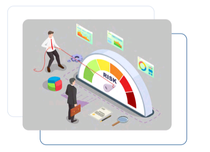
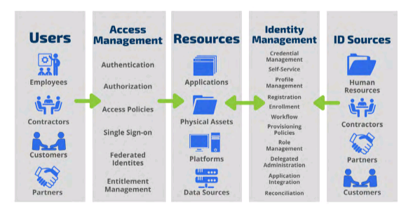
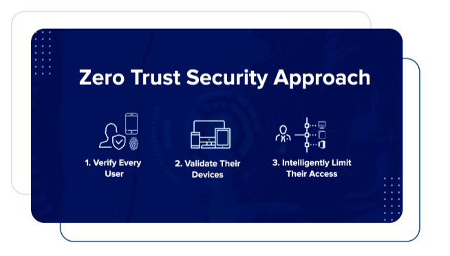

# CRD 2 Program Management

## Table of Contents

1. [IAM Risk Management](#iam-risk-management)
2. [Program Delivery](#program-delivery)
3. [IAM Implementation Considerations](#iam-implementation-considerations)
4. [Segregation of Duties](#segregation-of-duties)
5. [Communication](#communication)
6. [Identity and Access Management Model](#identity-and-access-management-model)
7. [Password Alternatives](#password-alternatives)
8. [The Principle of Least Privilege](#the-principle-of-least-privilege)
9. [Defense-In-Depth](#defense-in-depth)
10. [Layered Security in IAM](#layered-security-in-identity-and-access-management)
11. [Zero Trust](#zero-trust)

## IAM Risk Management

Risk management is an important aspect of identity and access management (IAM) and must be considered in IAM program management because it helps organizations identify, evaluate and mitigate potential security risks related to user access, to systems and data.  

Some key risk management strategies in IAM include: 

- Conducting regular access reviews
- Implementing strong authN and authZ mechanisms
- Limiting user privileges to only those required for their job function
- Monitoring and analysing access logs to detect and investigate any suspicious activity
- Developing and implementing a comprehensive incident response plan

## Program Delivery

An IAM program must implement deliverables in accordance with four strategic objectives.

- Simplify the User Experience
- Enable Collaboration
- Protect Resources
- Facilitate Technology

For each objective, <strong>the benefits of IAM improvements</strong> are identified and categorized by the following three user types:

- <strong>End Users:</strong> A general term used to refer to multiple user types such as employees, consultants, contractors, vendors and customers.

- <strong>Application Owners:</strong> They work with the IAM group to determine how best to integrate their applications with IAM services in order to meet business needs.

- <strong>Access Administrators:</strong> Individuals who assign roles, group memberships and/or other attributes to a user.

## IAM Implementation Considerations

Some of the key IAM implementation considerations to be kept in mind are:

- <strong>Job role or application access matrices using rule mining tools:</strong> This serves as the logical access foundation needed to embrace cloud-based mobile applications in addition to ensuring appropiateness of access as key regulatory requirement, espacially for data privacy.
- <strong>Automated workflow-based access request and approval processes:</strong> Using Job role or application access matrices and segregation of duties to increase consistency and efficiency of IAM procedures.
- <strong>Entitlement warehouse solution:</strong> Streamlined provisioning / access attestation and provides a centralized view of access privileges.
- <strong>Access proxy solutions, central authN (application, host and database layers):</strong> Improves end-user experience and addresses key requirements around user de-provisioning.
- <strong>Risk-based AuthN solutions:</strong> Enables secure access for sensitive transactions and fulfills key regulatory requirements around MFA.
- <strong>Identity Analytics and behavioral analysis services to integrate with Data Loss Prevention (DLP) and security information and event management:</strong> This helps to enable behavior-based profiling and identifies access outliers for risk-based verification and effective reducation of insider risk. Context-aware identity and access intelligence solutions are being used to identify anomalous activities/exception-based access, perform account analysis, execute oversight and monitoring functions, thereby, helping to protect data governed by privacy regulations.
- <strong>Data and access management process governance program, which includes HR, application owners, information security and IAM stakeholders:</strong> This helps to confirm that the appropriate people (i. e. departments, roles) are supporting and sponsoring the IAM program which is vital to the success of process and technology changes.
- <strong>Federation Solutions:</strong> This imrproves end user experience and management of identities for cloud-based applications.
- <strong>Consider emerging solutions that combine logical and physical security:</strong> These solutions will address business risks related to critical infrastructure protection.
- <strong>Design solutions with future scalability requirements in mind:</strong> These access transformation initiatives are impacted by negative end user experience, including performance delays; therefore, it is imperative to deploy solutions after considering future adoption and scalability requirements.

## Segregation of Duties

Segregation of duties or SOD is a principle of internal control that involves dividing critical tasks and responsibilities among multiple people to reduce the risk of fraud or error.

### Why SOD is important to IAM

Segregation of duties in IAM is important because it helps to prevent conflicts of interest and reduces the risk of unauthorized access to sensitive information.

> SOD minimizes the occurence of fraud by breaking down processes and separating tasks to ensure a single employee is not able to commit and conceal fraud in the normal course of business.

### SOD in Log Management

Segregation of duties (SoD) in log management is important to ensure the integrity and security of log data. 

For example, the person responsible for creating and maintaining the logs should no t be the same person who has the authority to modify or delete them. Similarly, the person who analyses the logs and detects security incidents should not be the same person who has the ability to tamper with or manipulate the logs.

### How to Implement SoD

To implement segregation of duties, follow these general steps.

- Identify critical tasks and responsibilities in your organization that require separation of duties.
- Determine the specific roles.
- Document the segregation of duties policy and communicate it.
- Implement controls to enforce the policy.
- Monitor compliance with the policy.

When implementing segregation of duties, it's important to ensure that the individuals involved have the necessary skills and training to perform their assigned tasks effectively.

## Communication

As part of it's policy statement, an organization should define how to communicate the creation, deletion and change of user identities. There should be a centralized point of contact in IT to receive and send communications related to the creation and deletion of, or changes to, a user profile and access. The means of communication can take the form of an automated message, verbal message or paper documentation. Any communication regarding the identity should conform to the organization's data classification policy.

When communicating about an identity's creation or changes through electronic or paper means, staff must be cognizant of any data classification restrictions and requirements for identity configuration information.

The organization should also require users to change the password after its first use to prevent misuse of the identity and to mitigate risks associated with its interception by an unauthorized party.

## Identity and Access Management Model

The AAA identity and access management model is a framework which is embedded into the digital identity and access management world to manage access to assets and maintain system security. AAA stands for AuthN, AuthZ, and Accounting which we will cover in depth below.

### 1. Authentication

AuthN is based on the idea that each individual user will have unique information that sets him or her apart from other users to provide proof of identity when they identify themselves.

There are primarily four types of authN methods:

- i. **Static passwords** which remain active until they are changed or expired.
- ii. **One-time password (OTP)** such as codes delivered through SMS texts or tokens used for each access session
- iii. **Digital Certificate**
- iv. **Biometric Credential**

Authentication types fall within one of the following forms:

- **Something you know** such as a password.
- **Something you have** such as a key fob or cell phone.
- **Something you are** such as your finger prints, voice, hand geometry, etc. also called "biometrics authN".

When we combine more than one of these categories, it's called Multi-Factor Authentication (MFA) which makes it difficult for someone to authenticate as another person. For example, if a hacker steals a user's password, he'd also have to steal the mobile phone to access the code sent by the SMS text or possess the key fob that displays the code which syncs with the rotating code inside the system being accessed. Using two passwords is not considered 2FA because both passwords fall under the category of "something you know". It's like placing two locks on a door at home that could be opened with the same key.

Most companies are moving toward MFA.

<strong>Biometic authentication</strong> is slowly being adopted as technology becomes more cost effective and errors associated with biometric authN are reduced. However, biometric authN persents a different set of privacy and security issues. 

> According to the National Institute of Standards and Technology (NIST), using two-factor authN which includes text messages is not a good solution because text messages can be intercepted, however, companies have resisted the argument and continue to use 2FA with a password and a code delivered by phone texts. 

>The Industry believes that using 2FA with two authN methods is the best option for now to improve security and justify costs in case one method is compromised.

### 2. Authorization

Authorization is represented by the second A in the AAA identity and access management model which is the process of granting or denying a user access to system resources once the user has been authenticated through the username and password.

The <strong>Principle of Least Privilege</strong> requires that users, processes, programs and devices must only be granted sufficient access necessary to perform their required functions and nothing more. Any authZ beyond normal job functions opens the door for either accidental or malicious violations of security objectives; <strong>confidentiality, integrity, and availability</strong>.

The principle of least privilege must be applied at all times until it's time to temporarily escalate access when warranted by business requirements.

### 3. Accounting

The third A in the AAA identity and access management model refers to Accounting, which is the process of keeping track of a user's activity while accessing the system resources, including the amount of time spent in the network, the services accessed while there, and the amount of data transferred during the session.

In order to be effective in IAM accounting, generic and shared accounts must be avoided so that the actions of each individual can be accounted for.

## Password Alternatives

- <strong>Two Factor Authentication</strong> - Two-factor authN requires users to enter a unique code sent to a second email address or mobile number to be used along with the password for access. However, even when MFA is used in some cases such as privileged account access, when password is one of the authN components, the security of the system is reduced.
- <strong>Personal USB key</strong> - Users simply plug in the USB key into the PC and the profile is loaded to grant access. A browser such as Chrome can be configured to work with the USB keys and store all online logins within the master key which means no more memorizing and using passwords in ways that would jeopardize security.
- <strong>Virtual Token</strong> - Similar to the USB concept presented above, this password alternative requires employees to carry a piece of pre-recorded information with them which can be incorporated into the smartphone and mobile apps that display a temporarily-generated, unique image on the phone screen that users can hold up to the webcam to authenticate. The image can't be stolen as each one is randomly generated and lasts for a limited time.
- <strong>Biometric Options</strong> - As mentioend above, biometric AuthN uses a person's characteristics to identify and authenticate the person. Biometric technology is advancing rapidly and the market for biometric systems is projected to grow.

The list of biometric authN options includes:

- Face recognition
- Fingerprint and geometry (although it is easier to copy or steal a finger than other human parts)
- Hand geometry
- Ear geometry (by simply pressing it against the phone screen during a phone call)
- Eye iris (or retina recognition)
- Gait (or behavioral biometric)
- Heart rhythm (can be used in wristbands and other devices for wireless identification to computers, cars, houses and in stores for making payments iwth NFC interface)
- Butt biometrics (no joke)
- Nose (can be used to identify a person as a distinct human feature although it is often surgically modified and rendered useless for authN)
- Vein matching (also uses a finger or a palm, but provides a few additional security benefits though vein analysis of only alive persons which makes it difficult to fake)
- Sniff Test (although in early stages with 10% failure rate can filter out smells like hand cream or changes in odor caused by diet and disease with an artificial nose to identify a person)

## The Principle of Least Privilege

The principle of least privilege applies to Authorization in the AAA identity and access management model.

<strong>AuthZ</strong> is the process that grants a user approval to take certain actin in the designated systems whether it is to view, modify, share or delete data. Authorization is concerned with what the user is allowed to do.

The granularity of authZ is only as good as the sophistication of the system which supports the access approval decision making process and enforcement of approved access.

The <strong>access approval process</strong> is designed to grant access based on the user's role and job duties which is referred to the principle of least privilege, which states users, devices, programs and processes which are interconnected or must access each other to communicate and take certain actions, should be granted jsut enough permissions to do their required functions.

<strong>The risk of excessive and unnecessary access</strong>, as well as the risk of insufficient access to perform a certain task to accomplish a goal, should not be overlooked. Excessive access rights beyond someone's normal job functions create an opportunity for errors, accidents and exploits which can affect the confidentiality, integrity and availability of data and systems. Insufficient access or access rights not provided in a timely manner can also negatively affect business operations.

When someones access is beyond that persons required access to perform their job duties, then that access is considered to be beyond the principle of least privilege.

Sure, access rights may be escalated for some persons to accomplish certain tasks such as when replacing another person who has higher privileges, however, the escalated access may have to be selective, temporary and approved.

## Defense-In-Depth

Defense-in-depth or layered security is a strategy that involves implementing multiple security measures to protect a system or organization.

The idea is to created multiple layers of security controls that can work together to provide better protection against security threats. Each layer of security may have different security mechanisms and controls, such as firewalls, intrusion detection systems, access controls, encryptions and security awareness training. The goal of layered security is to make it more difficult for attacks to penetrate a system or network by increasing the overall complexity and resilience of the security infrastructure.

## Layered Security in Identity and Access Management

Layered security in identity and access management (IAM) is an approach to protecting digital assets by implementing multiple security measures to verify the identity of users and control their access to systems and data.

For example, a layered security approach in IAM might involve:

- <strong>A user authN layer</strong> such as a password or biometric verification, to confirm the users identity.

- <strong>A second layer of access control</strong> such as role-based access or attribute-based access control, to limit what the user can access based on their job responsibilities or other attributes.

- <strong>A third layer of security controls</strong> such as activity monitoring, to detect suspicious behavior and prevent unauthorized access.

By using a layered security approach in IAM, organizations can provide a better protection for their digital assets and reduce the risk of security breaches caused by compromised credentials or unauthorized access.

## Zero Trust

Zero TRrust is a security concept that involves always <strong>verifying the identity of users and devices before allowing access to network resources</strong>. It can be an effective approach to preventing cyberattacks by reducing the attack surface and making it harder for attackers to move laterally within a network. However, it is not a panacea and must be implemented in conjunction with other security measures, such as regular security updates, vulnerability management and incident response planning.

### Steps to Implement Zero Trust

Here are some best practices for organizations to implement a Zero Trust model, and significantly enhance their security posture and reduce the risk of cyberattacks.

- <strong>Least privilege access</strong> - Limit access to resources to the minimum, necessary for users to perform their job functions.
- <strong>Network segmentation</strong> - Create micro-segmentation based on the principle of least privilege access, so that only authorized users can access the specific resources they need.
-  <strong>Continuous monitoring</strong> - Continiously monitor all network resources for abnormal activity and take action when anomalies are detected.
-  <strong>Multi-Factor Authentication</strong> - Implement multi-factor authentication for all users and ensure that passwords are strong and regularly updated.
-  <strong>Strong Identity and Access Managment</strong> - Use strong identity and access management controls to enforce access policies, verify user identities and manage user accounts.
-  <strong>Regular vulnerability scanning and patching</strong> - Regularly scan for vulnerabilities and promptly apply patches to eliminate security risks.
-  <strong>Encryption and data protection</strong> - Implement encryption and data protection mechanisms to secure data in transit and at rest.
-  <strong>Incident Response Planning</strong> - Have a robust incident response plan in place to quickly respond to security incidents, and continiously test and update the plan.