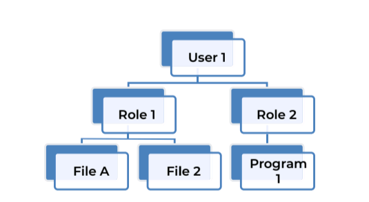
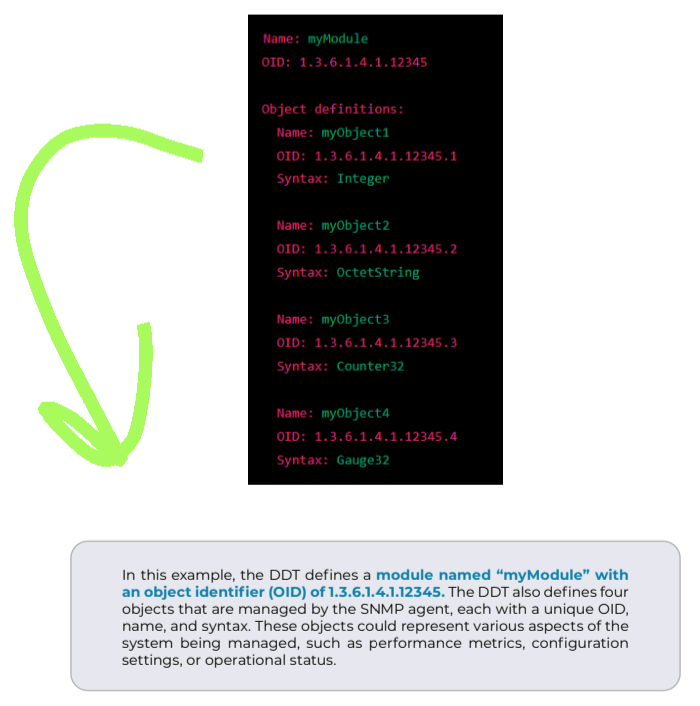

# CRD 5 - Provisioning and De-Provisioning

## Table of Contents

1. [Access Controls](#access-controls)
2. [Access Control Models](#access-control-models)
3. [Provisioning and De-Provisioning](#provisioning-and-de-provisioning)
4. [Entitlement](#entitlement)
5. [Drivers and Challenges](#drivers-and-challenges)

# Access Controls

The fundamental goal of any access control mechanism is to provide a verifiable system for guaranteeing the protection of information from unauthorized and inappropiate access as outlined in the security policies.

## Confidentiality

Data confidentiality refers to the practice of keeping sensitive or confidential information private and protected from unauthorized access, disclosure or use. It can be achieved through a combination of security measures, such as encryption, access controls and authentication.

Data confidentiality is an important component of data security and is often required by industry regulations and compliance standards.

## Integrity

Data integrity refers to the accuracy, consistency and reliability of data over it's entire lifecycle. It involves ensuring that data is complete, accurate and trustworthy, and trhat it has not been tampered with or corrupted in any way.

# Access Control Models

Access control models are gfenerally concerned with access management decision that take into consideration subjects which include any entity such as a user, system process or another device accessing objects such as data, application code or system configuration settings.

The most common access control models are the Mandatory Access Control, Discretionary Access Control, and Role-Based Access Control.

## 1. Mandatory Access Control

Mandatory Access Control or MAC is defined as any access control model that enforces security polkicies independent of user operations. In a mandatory access control model, users and data owners do not have as much freedom to determine who can access files and other resources. This type of model is commonly used in environments where information classification and confidentiality is of utmost importance, such as in the military or government agencies.

When a MAC model is used, every subject and object must have a sensitivity label.

## 2. Disretionary Access Control

Unlike the MAC model where decisions to allow or deny access are made by the system according to pre-determined policies, Discretionary Access Control or DAC allows subjects or the resource owners the disrection to device access assignments to objects. This model is called disretionary because the control of access is at the discretion of the resource owner.

Discretionary Access Control is the most widely used method of access control which is adopted by most commercial and academic products.

### a. Access Control Matrix

An Access Control Matrix is a table of subjects and objects indicating what actions invididual subjects can take upon individual objects. ACM is a data structure that programmers implement as table lookups that will be used and enforced by the system.

|Subject|File 1 | File 2| File 3 | File 4|
|------|----------|-----|--------|-------|
|George | Read | Read, Write | Read | Full Control |
| Mike | No Access | Read | Read | Read, Write |
| Larry | Read, Write | Read, Write | No Access | Read, Write |
| Robert | No Access | Read, Write | Read | No Access |

### b. Access Control List

An Access Control List or ACL defines the authorization level for each user to access resources. Authorization can be specified to an individual or group of users.

An ACL maps values from the Access Control Matrix to the objects and is the representation of object rights as a table of subjects mapped to their individual rights over the objects.

ACLs require the operation system to either perform a rights lookup on each object access or somehow maintain the subjects' active access rights.

### c. Capability List

Capability Lists are similiar to ACLs but instead of listing the subjects and their rights, capability lists represent subjects rights as mappings of objects to rights. In other words, subjects are bound to the capability table, whereas the objects are bound to the ACL. See the above table for an example.

## 3. Role-Based Access Control

Role-Based Access Control or RBAC is considered a much more generalized model that either MAC or DAC, which provides a policy neutral framework that allows RBAC to be customized by application. RBAC is the main alternative to the ACL model.

RBAC ensures the security objectives of integrity and confidentiality by enforcing security policies through the assignment of rights to roles rather than individuals.

RBAC also stands apart from other access control models by ranted rights to transactions, rather than to subjects. As rights are granted to roles in a RBAC model, it may appear that is operates just like the DAC model but the difference lies in the right assignment around transactions.

A transaction-based access rights management framework helps ensure system security by explicitly controlling which resources can be accessed and how.

## 4. Rule Based Access Control

Rule Based Access Control, also recognized with the acronym RBAC assigns roles to used based on criteria defined by the resource custodian or system admin. For example, if someone is only allowed access to files or a phsyical location during certain hours of the day, Rule Based Access Control would be used to control access accordingly.

## 5. Domain Type Enforcement (DTE)

Domain Type Envorcement (DTE), an extension of Type Enforcement (TE) is when objects are assigned types in the columns of the access control matrix. The DTE extension is to assign subjects to domains and complete the matrix transformation so the access control matrix is a Domain Definition Table (DDT) with rows of domains and columns of types.

## 6. Domain Definition Table (DDT)

A Domain Definition Table (DDT) is a data structure used in a Simple Network Management Protocol (SNMP) to define the structure of a management information base (MIB). A DDT defines the names, syntax and semantics of the various objects that are managemend by an SNMP agent. Here's an example:

# Provisioning and De-Provisioning

Effective and efficent user provisioning which leverages technology, creates value by lowering support costs, improving user service and strengthening network security by:

- Propagating changes to identity and entitlement data from one system to another through identity synchronization, auto-provisioning and auto-deactivation.
- Enabling business users to request, review and approve changes to identity attributes and entitlements.
- Enforcing security policies using roles, segration of duties, standard naming conventions etc.
- Reporting on current and historical data about users and their entitlements.

A user provisioning system is typically a shared IT Infrastructure which is used to manage users and their identity attributes, and security entitlements centrally.

User provisioning is intended to make the creation, management and deactivation of login IDs, home directories, mail folders, security entitlements and related items faster, cheaper and more reiable. This is done by automating and codifying business processes such as onboarding and termination and connecting these processes to multiple systems.

User provisioning systems work by automating one or more of the following processes:

- Auto-Provisioning, deactivation: Detect new user records on a system of record such as the HR Source of Record (SoR) and automatically provision those users with appropiate access on other systems and applications. Detect deleted or deactivated users on the SoR and automatically deactivate those users across integrated systems and applications.
- Self Service Requests: Enable users to update their own profiles (e. g. new home phone number) and to request new entitlements (e. g. access to an application or share).
- Delegated administration: Enable managers, application owners and other stake-holders to modify users and entitlements within their scope of authority.
- Access recertification: Periodically invite managers and application owners to review users and security entitlements within their scope of authority, flagging inappropriate entries for removal.
- Identity synchronization: Detect changes to attributes, such as phone numbers or department codes on one system and automatically copy to others.
- Authorization workflow: Validate all proposed changes, regardless of their origin and invite business stakeholders to approve them before they are applied to integrated systems and applications.

# Entitlement

Entitlement management refers to a set of technologies and processes used to coherently manage security rights accorss an organization. The objectives of entitlement are to:

- Reduce access administration cost
- Improve Service
- Ensure that users receive the appropriate access rights they need

These objectives are attained by creating a set of robust, consistent processes to grant and revoke entitlements across multiple systems and applications. Which are:

- Create and regularly update a consolidated database of entitlements
- Define roles, so that entitlements can be assigned to users in sets that are easier for business users to understand.
- Enable self-service requests and approvals, so that decisions about entitlements can be made by business users with contextual knowledge, rather than by IT staff.
- Synchronize entitlements between systems, whenever appropriate.
- Periodically invite business stakeholders to review entitlements and assigned roles to users, and identify inappropriate access which further examanination and removal.

# Drivers and Challenges

## Onboarding new users

When a user first joins the organization, an identity profile must be created in the IT environment. The manual or automated process used to create this identity is called onboarding, whch involves the creation of an identity's profile and the necessary information required to describe the identity.

The following must be considered in the onboarding process:

- New users need to get productive quickly.
- Access admin must ascertain that newly created accounts are appropriate. This usually means a process for requesting, reviewing and approving requests for creating new accounts.
- Lack of a central access administration can result in duplication of efforts and multiple accounts whenever a user may need access to the network, e-mail and multiple applications.

## Managing Change

Users often change roles and responsibilities within an organization. They may also change identity attributes (e. g. changes to a user's name, contact information, department manager, etc. ). Such changes trigger efforts to adjust user identity profiles and security rights. These changes may impact multiple systems, and take time and resources to process which msut be managed properly to keep productivity at peak.

## IT Support

In the context of routine use of systems, users often encounter problems that require technical support:

- Forgotten passwords.
- Intruder lockouts.
- Access denided errors.

Collectively, these problems typlically represent a large part of an IT help desks call volume. This means both direct cost (support staff) and indirect cost (lost user productivity).

## Termination

When users leave the organization, reliable processes are needed to find and remove their security privileges. These processes must be quick to minimize the time window available for exploitation by insiders as well as outsiders.

## Off-Boarding

Off-Boarding relates to the access removal, from all system, of employees who leave the company. Identities that no longer require access rights to the IT environment are identified, disabled and deactivated, reviewed to ensure they are inactive, and deleted from the IT environment after a predetermined period of time.