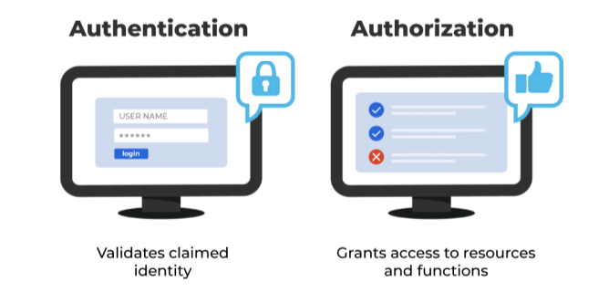

# CRD 6 - Enforcement

## Table of Contents

1. [Enforcement](#Enforcement)
2. [Authentication and Authorization](#Authentication-and-Autorization)
3. [Logging](#Logging)

## Enforcement

One of the weaknesses of manual user administration is that people are not consistent and make mistakes. As a result, security administrators cannot be expected to reliably enforce standards regarding what access rights users should have.

An identity management system can and should enforce standards over how changes are requested, what they contain, how they are authorized, and how they are fulfilled. 

This includes:

- Assigning unique identifiers:
+ Employee Numbers
+ Login IDs
+ E-Mail Addresses

- Object Placement:
+ Placing new users in the correct directory container
+ Creating mailboxes and home directories on appropriate servers

- Default Security Group:
+ Initial group memberships and role memberships
+ Initial security ACL/permission setup on home directories, mail folders and desktop profiles.
+ Setting of security-related attributes on applications and directories

- Change authorization:
+ Ensuring that change requests are submitted by authenticated users and signed if appropriate.
+ Ensuring trhat appropriate business stake-holders are invited to approve all change requests.
+ Deferring fulfillment until authorization is complete.

- Micscellaneous:
+ Default membership in mail distribution lists
+ Disk Quota allocation

Care must be taken to define standard policy for each of the above items before deploying a user provisioning system, as described in the following sections.

## Authentication and Authorization

> During the login process, the application performs a check to validate the user's identity. This process is called authentication.

> Once the identity is recognized and validated, the application will authorize the user to perform functions in the application based on the access rights associated with the user identity.

## Logging

Logging user identities, their access rights and the functions they perform in the application provides the organization with a means to examine several items:

- Are user identities and their access rights in compliance with the access rights approved for the user identity?
- Are user identities and their access rights misaligned with the access rights necessary for the user identity to perform its functional responsibilities?
- Are use identities performing all of the functions granted to them through the provisioning process?
- Are user identities making password change requests on a frequent basis?
- Are user identities accessing or attempting to access applications outside normal business hours?
- Are there unauthorized attempts to perform certain functions by registered or unregistered users?

