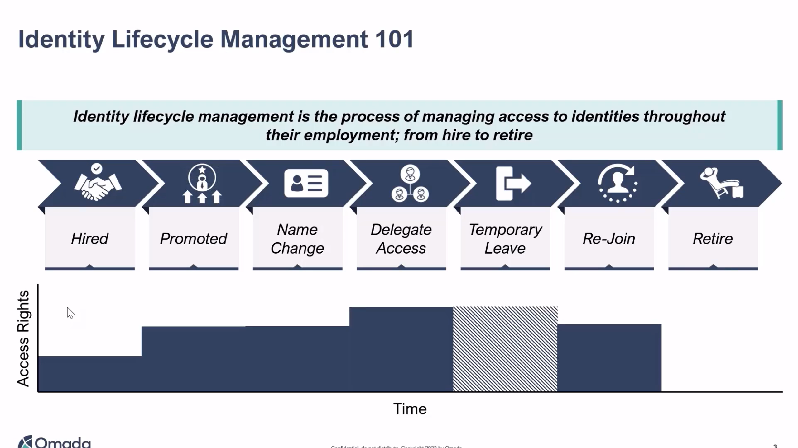
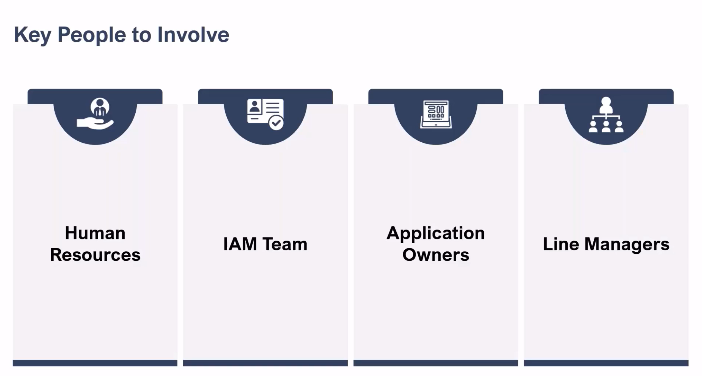
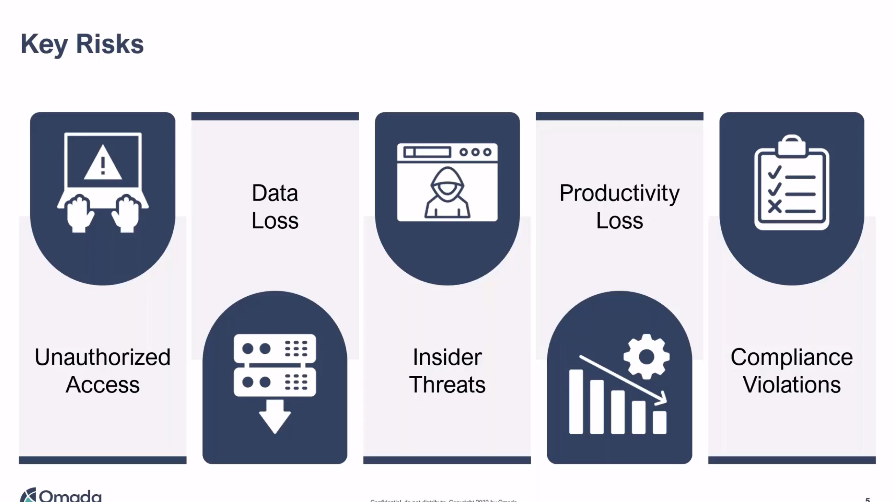
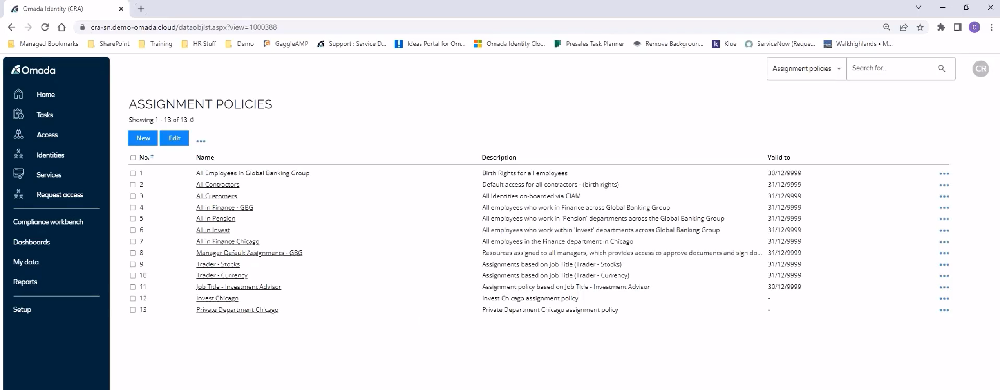
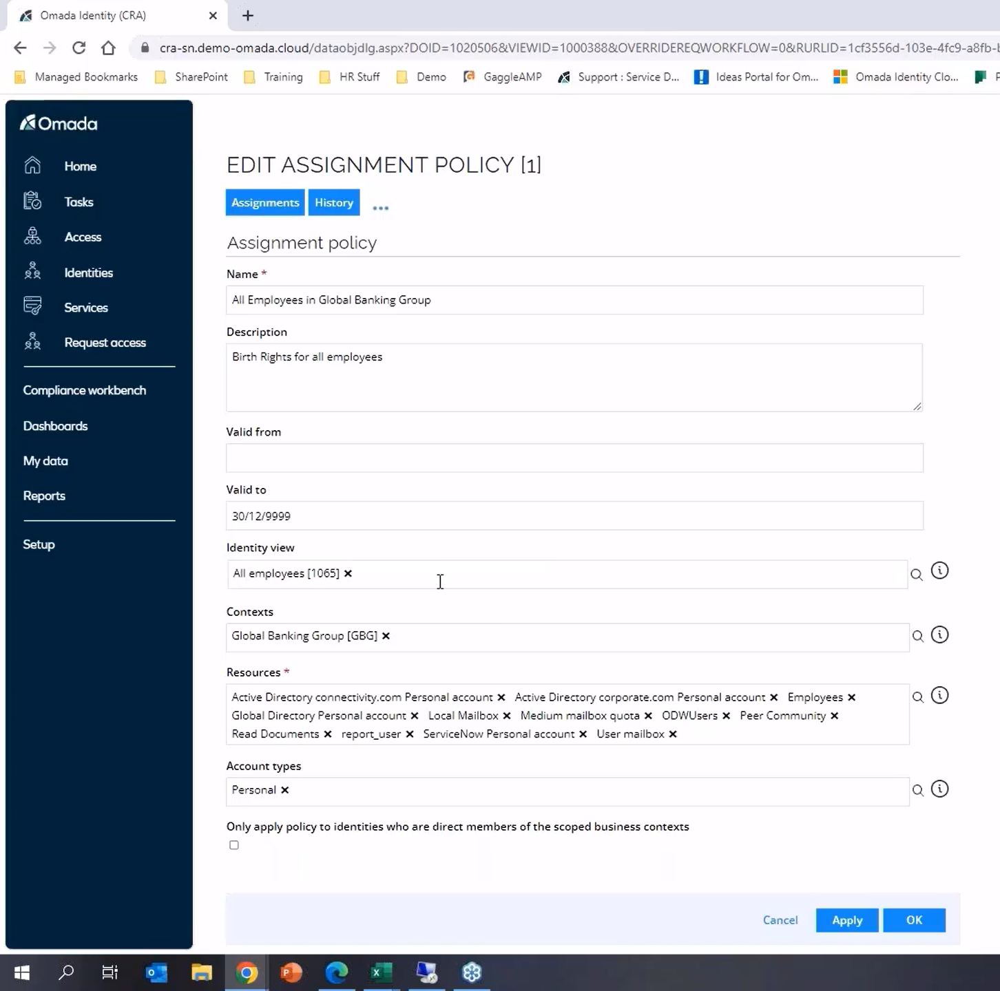
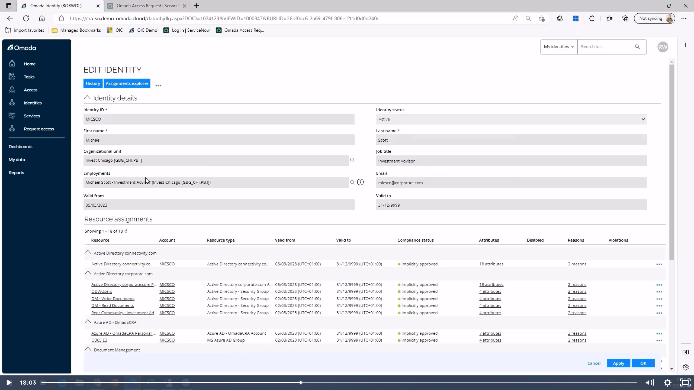
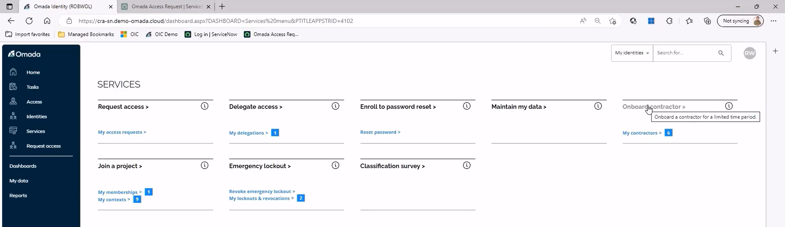
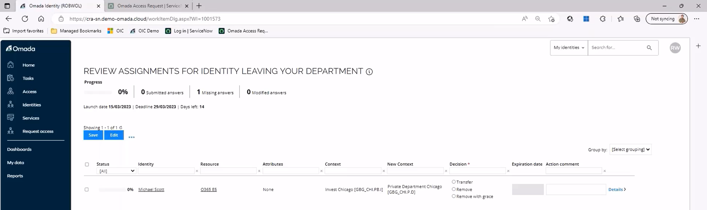
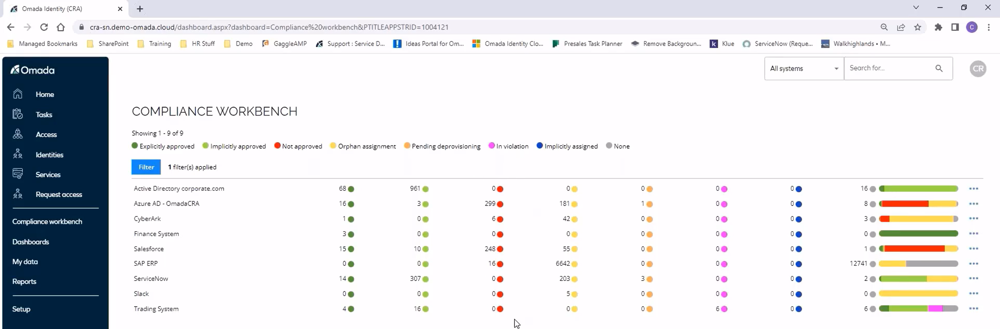
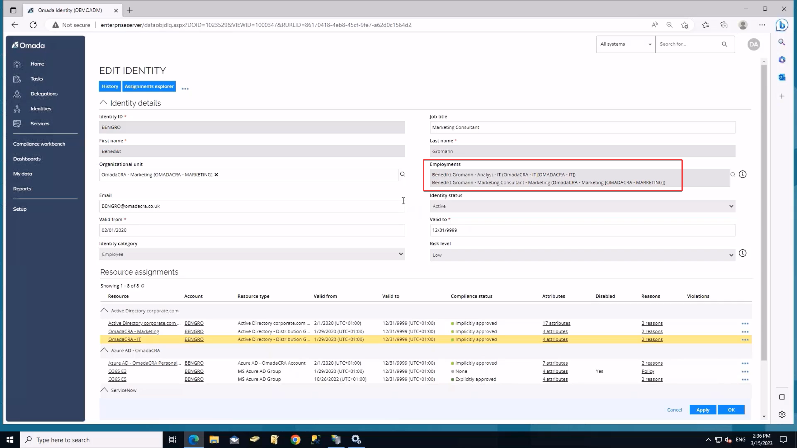

# From Hire to Retire: A Deep Dive on Identity Lifecycle Management
>Webinar Watched on 27/10/2023
>Added to CPE for CIAM Certification (45 Minutes Watched)

In this webinar, Craig Ramsay, Senior Solution Architect, and Andrew Silberman, Product Marketing Director, from Omada do a deep dive on how to successfully implement strong identity lifecycle management, including:

- Event driven onboarding for all identity types, including third parties
- How a contextual data model helps with all types of transfer/mover scenarios
- Flexible options for timely and automated provisioning and deprovisioning of access based on lifecycle events

## Slides

## Live Demo Screenshots

> Looking at Assignments 

> Identity Overview

> Services for Manager

We then see the move of a person to a new department. Back in the managers view he will see all the assignments of the leaving identity and has the possibility to reassign it:

The same goes for the new manager.

If access right was simply added via AD (by someone) it would show up in the non-approved bucket:

What if a user has multiple roles within the company?

