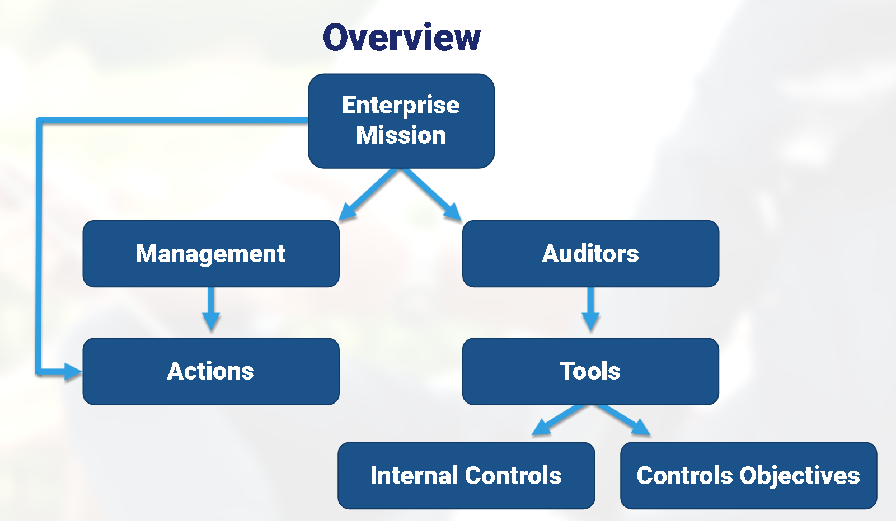
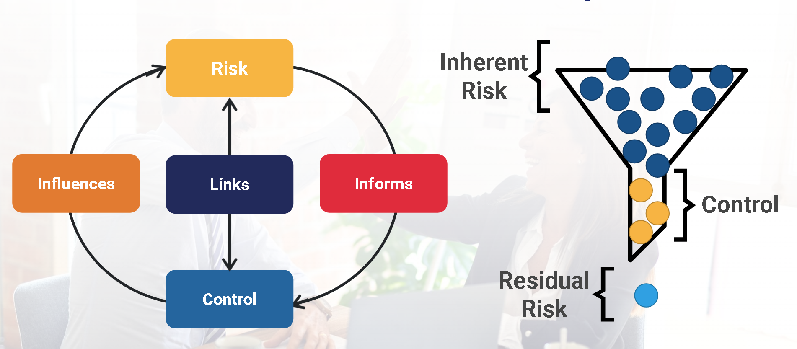
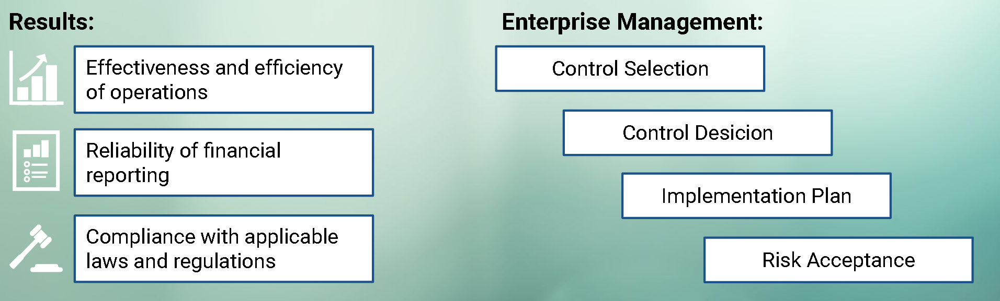

# IT Audit Fundamentals - Module 2

## Table of Contents

[Module 2, Topic 1: Internal Controls and Control Types](#module-2-topic-1-internal-controls-and-control-types)

# Module 2, Topic 1: Internal Controls and Control Types

## Learning Objectives

- Articulate the purpose of internal controls.
- Describe how controls contribute to the achievement of business objectives.
- Identify different types of controls.
- Describe the purpose and use of continuous auditing.
- Compare and contrast IT risk and related controls.
- Explain how to monitor and assess controls.

## Overview

## Control and Risk Relationship

## Internal Controls

- Composed of policies, procedures, practices and structures operating throughout the enterprise.
- Designed to provide reasonable assurance that business objectives will be achieved.
- Operate at all levels within the enterprise to mitigate exposure to risk.
- Ensure management directives are implemented and necessary action taken to address risk.

> Two of the key aspects defined by internal controls should be: What should be achieved? What should be avoided?

## Control Objectives

A statement of the desired result or purpose to be achieved by implementing control procedures in a particular process.

## IT Control Objectives

> Address IT control objectives relevant to specific IT-related processes.

- Authorization of Input
- Validation of the input
- Accuracy and completeness of transaction processing
- Reliability of overall processing activities
- Accuracy, completeness and security of the output
- Database confidentiality, integrity and availability

Other IT Control Objectives include:

- Confidentiality
- Integrity
- Availability Types of Controls

### Confidentiality

- Safeguarding assets
- System development lifecycle (SDLC) processes

### Integrity

- Operating system (OS) environment integrity
- User identification and authentication
- Operation efficiency and effectiveness
- Requirement, policy, procedure, law or regulation compliance

### Availabilty Types of Controls

- IT service availability
- Data and system protection
- System integrity and reliability
- Outsourcing contract terms, provisions and service level agreements (SLAs)

## Control Methods

> Managerial / Administrative

Oversight, reporting, procedures and operations of a process.

- Policy
- Procedures
- Balancing
- Employee development
- Compliance reporting
- Daily operations, functions and activities

> Technical or logical

Provided by and relate to use of technology including:

- Firewalls
- Intrusion Detection Systems (IDSs)
- Passwords
- Antivirus software
- Physical (?)

Requires proper controls to operate correctly.

> Physical

Controls and devices installed to physically restrict access to a facility or hardware:

- Locks
- Fences
- Closed-circuit TV (CCTV)

Requires maintenance, monitoring and ability to assess and react.

