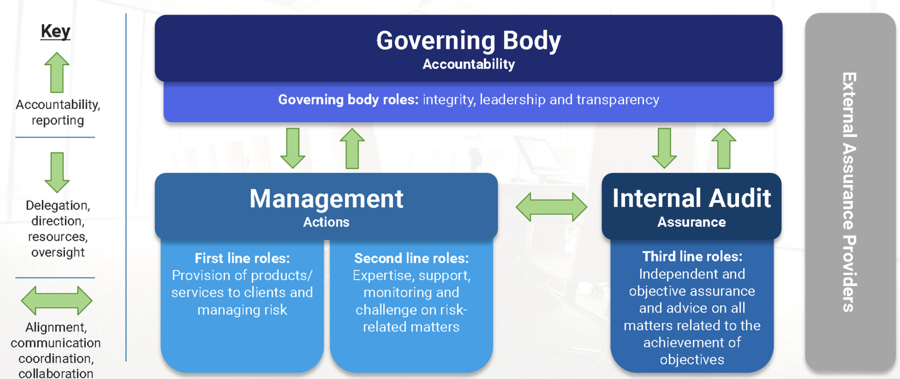

# IT Audit Fundamentals - Module 2

## Table of Contents

1. [Topic 1 - Audit Purpose, Roles, and Responsibilities](#module-1-topic-1---audit-purpose-roles-and-responsibilities)
2. [Topic 2 - Organizational Independence and Internal Enterprise Relations](#module-1-topic-2-organizational-independence-and-internal-enterprise-relations)
3. [Topic 3 - External Relationships](#module-1-topic-3-external-relationships)

# Module 1, Topic 1 - Audit Purpose, Roles, and Responsibilities

## Learning Objectives

- Define the purpose, roles, and responsibilities of the IT audit function.
- Describe the purpose, intent and contents of the audit charter.
- Explain strategic business goals and how they relate to IT and the audit function.
- Describe the overall governance process and how it relates to IT audit.
- Outline the lines of defense and the role that internal audit plays in risk management.

## What is an Audit

Audits are the formal examaination or testing of information systems to ensure:

- Effective operations
- Compliance with various regulations
- Functioning business operations

Audits are conducted:

- Internally
- Externally

## Purpose of Audits

The purpose of the audit function is to provide the board of directors and senior management independent assurance over the enterprises:

- Internal Controls
- Governance
- Risk Management Activities

Auditors independently and objectively ensure that management's actiojns are aligned with the enterprise's objectives. An IT audit can determine whether:

- Information Systems are compliant with applicable laws, regulations, contracts or industry guidelines.
- Information Systems and related processes comply with governance criteria, policies and procedures.
- Data and information have appropriate levels of confidentiality, integrity, availability and privacy.
- IT operations are being accomplished efficiently and effectiveness targets are being met.

## Responsibilities of the Audit Function

- Develop and implemented a risk-based IT audit strategy complying with IT audit standards.
- Develop the audit plan with a high-level description and specific audits.
- Conduct audits in accordance with IT audit standards.
- Report audit findings and make recommendations.
- Lead remediation to ensure that appropriate actions have been taken by management in a timely manner.

## Risk vs. Control

<strong>Risk</strong> is a potential uncertain event that may be harmful or may negatively impact objective achievement. 
<strong>Control</strong> represents the means of managing risk, including policies, procedures, practices, or organizational structures, which can be administrative, technical, managerial or legal.

## Audit Charter Overview

An audit charter is a document approved by those charged with governance that definews and documents the purpose, authority, responsibility, and accountability of the IT audit function. 

An audit charter:

- Establishew the internal audit position within the enterprise.
- Authorizes access to records, personnel, and physical properties relevant to the performance of IT audit and assusrance engagements.
- Defines the scope of audit activities.

## Audit Charter Details

- Independence, code of ethics and standards.
- Protocols that the IT audit and assurance practicioner will follow in the performance of engagements.
- Roles and responsibilities of the auditee during the IT audit or assurance engagement.
- The IT audit and assurance function's role in reporting irregularities and illegal acts.
- Purpose, responsibility, authority, and accountability.

## Purpose, Responsibility, Authority & Accountability

<strong>Purpose:</strong>

> Defining the audit charter purpose is a foundational requirement.

The audit charter should describe:

- Aims/goals of the audit functions
- Objectives of the audit function and the audit function's mission statement
- Scope of the audit function
- Work performed by the audit function

<strong>Authority:</strong>

> Audit authorizty describes the audit function's position within the enterprise, including lines of reporting and the rights of access. 

The audit charter should describe:

- Right of access to relevant information, systems personnel and locations by practicioners performing an audit engagement.
- Limitations of the audit function's and practicioner's authority.
- Processes to be audited that the audit function is authorized to audit.

<strong>Responsibility</strong>

> Audit responsibility describes the role, scope and objectives of the audit function.

The audit charter should describe:

- Implementation of the independence requirement.
- Relationships with external audit firms.
- Auditee's expectations and requirements.
- Professional and compliance standards that detail the requirements with which the audit function and practicioners will adhere to.

<strong>Accountability</strong>

> Accountability of the audit function is demonstrated through its reports to those charged with goverance

Finally, the audit charter should be:

- Communicated to executive/senior management
- Shared with groups being audited
- Reviewed periodically

Additional Guidance: [IT Audit Framework (ITAF), 4th Edition | Digital | English](https://store.isaca.org/s/store#/store/browse/detail/a2S4w000004Ko91EAC)

## Strategic Business Goals and IT

An IT auditor should have a strong awareness of the company's operations and objectives. This includes understanding business processes, internal controls and how IT supports the business strategy.

When an enterprise decides on a strategy, achievement of the strategy requires support from a variety of functions across the enterprise. IT plays a two-pronged role:

- Support of the strategy may be with customers.
- Support of the strategy may be through supporting the enterprise's operations.

When an IT auditor performs an IT audit or assessement, the IT auditor provides assurance to the enterprise of IT's contribution to business goals.

## IT Strategic Planning

IT strategic planning is the process of deciding enterprise objectives, changes in these objectives and the policies to govern the development of these objectives, and their execution.

Startegic plans should be fully aligned and consistent with overall enterprise goals and obectives.

Given the strategic plan's alignment with overall business strategy, an IT auditor should understand the importance of strategic planning.

- Management control practices and business assessement plans in the formulation of IT strategy.
- Contents of the strategic plans.
- Requirements for updating and communicating the plans.
- Monitoring and evaluation requirements.

## Three Lines Model

## Topic Summary

- The audit function develops and implements a risk-based IT audit strategy complying with IT audit standards based on the goals and objectives established through the governing body.
- Auditors independently and objectively ensure that management's actions are aligned with the established enterprise objectives.
- The audit charter defines and documents the purpose, authority, responsibility, and accountability of the IT audit function.
- IT auditors play a critical role in providing assurance to the board and senior management about IT's contribution to business goals.
- Under the Three Lines Model, management, the governing body, and internal audit have distinct roles and responsibilities that better enable strong governance and management.

# Module 1, Topic 2: Organizational Independence and Internal Enterprise Relations

## Learning Objectives

- Explain Organizational Independence and how it applies to the audit function.
- Describe relationships that auditors have with enterprise functions and oversight activities such as governance, risk management, compliance and information security.
- Explain IT department roles and responsibilities.

## Orginizational Independence

Audit services should be managed to establish and maintain organizational independence of the audit function. 

Independence represents:

- Self-Governance
- The freedom from conditions that threaten objectivity or the appearance of objectivity

This independence may be supported when the audit function:

- Reports to a level within the enterprise that provides independence enabling the IT audit function to perform its responsibilities without interference.
- Discloses the details of the impairment to the appropriate parties if independence is impaired.
- Does not perform non-audit roles in IT initiatives that require assumption of management responsibilities.
- Addresses independence and accountability of the audit function in its charter or engagement letter.

## Departmental Enterprise Relationships

An IT auditor must be aware of the purposes, responsibilities, and roles that enterprise relationships play as it applied to IT-related activites. Some of those relationships may include:

> Board of Directors and Senior Management

- Accountable and liable for the enterprise.
- Responsible for the stewardship of IT
- Aware of the enterprise's IT assets and their criticality to ongoing business operations.
- Responsible for ensuring the enterprises IT sustains and extends the enterprises strategies and objectives.

> Business Process Owners

- Identify process requirements
- Approve process design
- Manage process performance
- Have authority to commit resources, and usually at a high-evel in the enterprise.

> IT Strategy Committee

- Level of the board of directors to ensure the board is involved in major IT matters and decisions
- Accountable for managing the portfolios of IT-enabled investments, IT services and other IT resources
- Advisor to the board of directors and senior management on IT strategy

> IT Steering Committee

- Assists in the delivery of the IT strategy, oversees day-to-day management of IT service delivery and IT projects and focuses on implementation.
- Serves as a general review board for major IT projects.
- Avoids becoming involved in routine operations.

> Chief Information Officer (CIO)

- Accounts for IT advocacy; aligns IT and business strategies; plans resources, and manages the delivery of IT services, information; and deploys associated human resources.
- Concerned with how the enterprise can achieve strategic business and IT alignment.

> Chief Information Security Officer (CISO)

- Responsible for information security within the enterprise
- Position may not exist in all enterprises, but authority and responsibility for security must extend up the command structure. Failure to do so can result in ineffective alignment of business objectives and security activities.

> IT Department

- IT auditors will interact frequently with IT management and staff.
- Consequently, an IT auditor should be familiar with the structure and responsibilities of an IT department.

## Departmental Enterprise Relationships (IT Department)

IT Auditors will interact frequently with IT management and staff. As a result, an IT auditor should be famliar with the structure and responsibilities of an IT department, which may include:

> Systems Development

Involves programmers and analysts who implement new systems and maintain existing systems.

An IT auditor should:
- Be familiar with documentation standards and practices
- Understand current approaches to developing systems and how documentation is constructed and other components of the documentation.

> Project Management

- Responsibile for planning and executing IT projects
- Plays a central role in executing the vision of the IT strategy and IT steering committee.

> Help Desk (Service Desk)

- Responsible for technical questiosn and problems faced by the users.

> End-User Support

- Responsible for business application services.
- Acts as a liaison between the IT department and the end users.

> Data Management

- Responsible for the data architecture in larger IT environments and tasked with managing data as enterprise assets.

> Quality Assurance (QA)

- Responsible for negotiating and facilitating quality activities in all areas of IT.

> Third Party Management

- Provides direction to the oursourcer on issues and escalates internally within the enterprise and IT function.
- Monitors and reports on the service levels to management.
- Reviews changes to the contract.

> Infrastructure Operations and Maintenance

- Responsible for efficient and effective computer operations and the date center.

> Media Management

- Management of all program and data files that are maintained on removable media.

> Data Entry

- The information processing activity that includes batch entry or online entry.
- An IT auditor should be familiar with user department and the system application controls to ensure that data are validated, accurate, complete and authorized.

> Supervisory Control and Data Acquisition (SCADA)

- Systems used to control and monitor industrial and manufacturing processes and utility facilities.

> System Administration

- Responsibile for maintaining major multi-user computer systems.

> Security Administration

- Ensures the various users are complying with the enterprise security policy and controls are adequate to prevent unauthorized access to the enterprise assets.
- Typically works with compliance, risk management and audit functions to ensure security is appropriately designed and updated based on audit feedback or testing.

> Database Administration

- Responsibile for the custody of an enterprises data, and the definition and maintenance of the data structures in the enterprise database system.
- Responsible for the security of the shared data stored on database systems.

> Systems Analysis

- Responsible for the design of systems based on the needs of the user.

> Security Architecture

- Responsible for the evaluation of security technologies; design of security aspects of the network topology, access control, identity management and other security systems; and establishment of security polices and security requirements.

> System Security Engineering

- Provides technical information system security engineering support to the enterprise and interacts with other enterprises, including acquisition, system management, certification, accreditation and evaluation.

> Application Development and Maintenance

- Responsible for developing and maintaining applications.
- Development can include developing new code or changing the existing setup or configuration of the application.

> Infrastructure Development and Maintenance

- Responsible for maintaining the systems software.
- Should have access to only the system libraries of the specific software they maintain.

> Network Administration

- Responsible for key components of this infrastructure.

## Enterprise Function Relationships

The IT auditor must understand three important enterprise functions: Risk Management, Compliance, and Information Security.

<strong>Risk Management</strong>

Risk Management ins the discipline by which an enterprise in any industry assesses, controls, exploits, finances and monitors risk from all sources for the purpose of increasing the enterprise's short and long-term value to its stakeholders.

The management of risk must:

- Balance the operational needs of the business against the need for effective controls, while maintaining productivity.
- Evaluate risk across the entire enterprise, not just system-wide or department-wide.
- Identify the IT-related business vulnerabilities and assess their impact upon stakeholders.

<strong>Compliance</strong>

Compliance applies to the adherence to, and the ability to demonstrate aherence to, mandated requirements defined by laws and regulations, as well as voluntary requirements resulting from contractual obligations and internal policies.

Compliance issues are a concern of the board and include issues of:

- Data governance
- Data privacy and protection
- Operational risk
- Information Security

The IT auditor should review legislative and regulatory requirements pertaining to the access and use of IT resources, systems and data to assess whether IT assets are effectively protected and whether associated risk is managed.

When determining an enterprises level of compliance with external requirements an IT auditor should be aware of:

- Government or other relevant external requirements.
- Applicable laws and regulations.
- External requirements that affect business plans and enterprise policies, standards, procedures and business application.
- IT department activities that address adherence to laws or regulations.
- Enterprise procedures that address these legal and regulatory compliance requirements.
- Contracts or agreements with external IT service providers that require legal or regulatory requirements related to services provided.

<strong>Information Security</strong>

Information security ensures that within the enterprise, information is protected against disclosure to unauthorized users (confidentiality), improper modification (integrity), and non-access when required (availability).

Information security exists to support and further the business objectives of the enterprise by managing risks to limit disruptions to acceptable levels. To accomplish this objective, all enterprise processes must be assessed and the appropriate security requirements applied to minimize disruptions and achieve the business objectives.

The IT auditor is responsible for the evaluation of information security policies, standards and procedures to ensure:

- Completeness
- Alignment with generally accepted practices
- Compliance with applicable external requirements

IT audit can help to determine information security deficiencies from a controls and compliance standpoint and are one of the essential resources in strategy development.

## Topic Summary

- The IT audit functions should be independent of the area or activity being reviewed to allow objective completion of the audit and assurance engagement.
- An IT auditoir must be aware of the purposes, responsibilities, and roles surrounding the various stakeholders in the enterprise as applied to IT-related activities.
- The IT department includes a range of roles from hardware and software deployment to internal support and even incident response.
- IT auditors must understand risk management, compliance and security functions within the enterprise.

# Module 1, Topic 3: External Relationships

## Learning Objectives

- Articulate the difference between internal and external audit and how the two functions work together.
- Describe how the audit function uses the work of other auditors and experts.

## External Audit Firm Relationships

An IT audit function often maintains relationships with entities outside an enterprise. These relationships
may be with:

- An IT auditor from an external firm.
- A management consultant.
- An expert in the engagement area appointed by senior management or team.
- Government regulators.
- Compliance program assessors.

An external audit firm typcially provides many services and may include:

## Comparison of Internal and External Assurance Reviews

|Characteristics    | Internal Audit | External Audit |
|-------------------|----------------|----------------|
|Independence Requirements|Independence of internal auditors should be established, verified and maintained | Independence of the external auditors should be establiehd, verified and maintained |
| Interested Party | Executive management, audit committee, operational management and enabler owners involved | Primarily directed toward the board / shareholders, but of importance to the enterprise in general |
|Responsible Party | Management and business enabled owners involved | The board and executive management involved |
| Assurance Provider | Internal Auditor | External Auditor
| Reporting Format and Requirements | Internal consistency required, in line with professional standards | Highly regulated / standardized |
| Governing Rules/Standards | Standardized approaches based on good practices. Professional standards of ethics required | Adherence to applicable codes of ethics and professional standards required |
| Level of Trust | Medium - Depends on the skill and expertise of the internal audit function and opn the cooperation of the accountable party | Maximum - The skill and expertise of the external auditor is an essential requirement of all audit assignments

## External IT Audit Scope

If IT audit services are provided by an external audit firm:

- The internal audit function should be independent.
- The scope and objectives of these services should be documented.
- The internal audit function should report to an audit committee.

The external audit team may rely on internal audit functions of an enterprise. The relationship should be described in the audit charter or engagement letters. This relationship should be documented in detail. Considerations may include, but not be limited to, how:

- Work will be coordinated to minimize duplication of effort.
- Audit docuemtnation and evidence will be shared.
- Work planned by the external auditors will affect the audit plan for the coming period.

## External Authors, Protocols and Considerations

When a part, or all of IT audit services are proposed to be outsourced to an external provider, the following should be considered when using the services of other auditors and experts:

- Restrictions on outsourcing of audit/security services provided by laws and regulations.
- Audit charter or contractual stipulations.
- Impact on overall and specific IT audit objectives.
- Impact on IT audit risk and professional liability.
- Independence and objectivity of other auditors and experts.
- Professional competence, qualifications, and experience.
- Scope of work proposed to be outsourced and approach.
- Supervisory and audit management controls.
- Method and modalities of commuinication of audit work results.
- Compliance with legal and regulatory stipulations and professional standards.
- Testimonials / references and background checks.
- Access to systems, premises and records.
- Confidentiality restrictions to protect customer-related information.
- Use of computer-assisted auditing techniques (CAATs) and other tools.
- Standards and methodologies for performance of work and documentation.
- Nondisclosure agreements.

## External Audit Objectivity and Independence

It is the responsibility of the IT auditor or enterprise employing audit services to do the following:

1. Clearly communicate audit objectives, scope and methodology through a formal engagement letter.

2. Establish a monitoring process (of the external audit firm) regarding planning, supervision, review and documentation. Review the work perfomed and reports issued by external IT auditors or experts to confirm that:

- Scope has been met.
- Significant assumptions have been identified.
- Findings and conclusions have been agreed to by management.

3. Assess the usefulness and appropriateness of the work and reports of external IT audit providers and assess the impact of significant findings on the overall audit objectives.

If the work of other experts does not give adequate and acceptable audit evidence, an IT auditor should perform additional test procedures based on their assessment of the work of other experts.

An IT auditor should assess whether additional testing or re-performance of other experts' work is necessary.

## Topic Summary

- Internal auditors may have a narrower focus on providing assurance to enterprise departments while external auditors can provide special expertise and a broad view of the enterprise.
- Together, internal and external auditors provide independent and objective assurance across a broad range of focus areas such as risk, compliance and enterprise governance.
- Internal auditors assess the usefulness and appropiateness of the work and reports of external IT audit providers and the impact of significant findings on the overall audit objectives.