# CDS Personal Notes

> Most of this is in german. It's only intended for personal use.

# Table of Contents

## Day 1 Notes

1.[Service Value Stream](#service-value-stream)
2.[Work Culture](#work-culture)
4.[Competence Profiles](#competence-profiles)
5.[Shift Left](#shift-left)

## Day 2 Notes
> Coming Soon

## Day 3 Notes
> Coming Soon

> Easy way to remember the four dimensions of Service Management

<strong>VOIP</strong>  
<strong>V</strong>alue Stream 
<strong>O</strong>organization 
<strong>I</strong>nformation and Technology 
<strong>P</strong>Partners and Suppliers 

## Service Value Stream

> Service Wertstrom ist eine Linie.

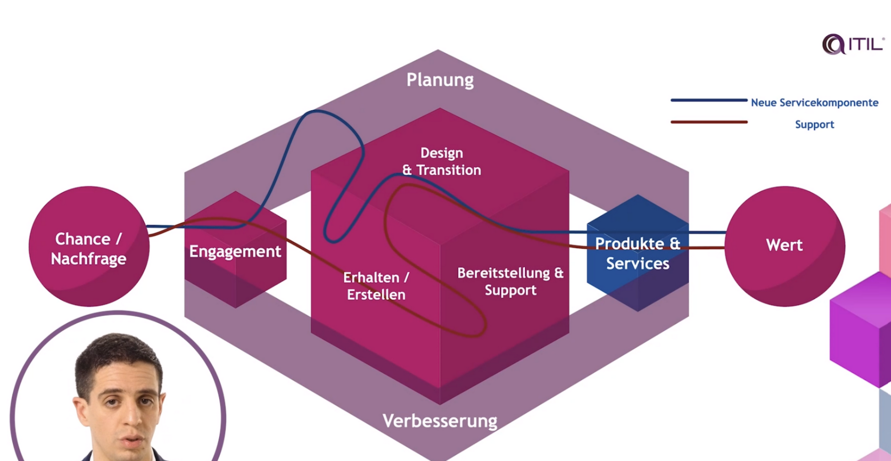

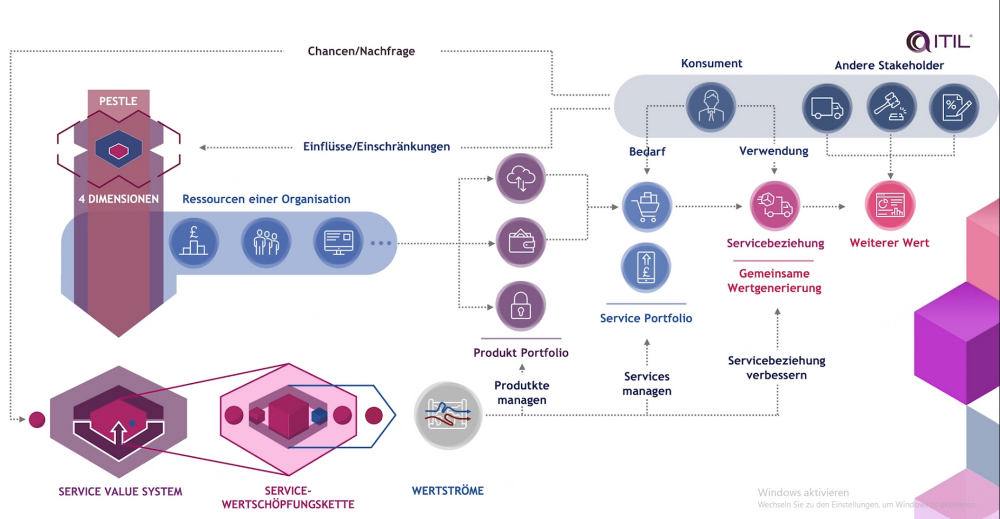

Definition "Resilienz": Schnelle Wiederherstellung nach Fehlern und NICHT "Wiederstandsfähigkeit". Wird oft durcheinander gebracht.  

## Work Culture

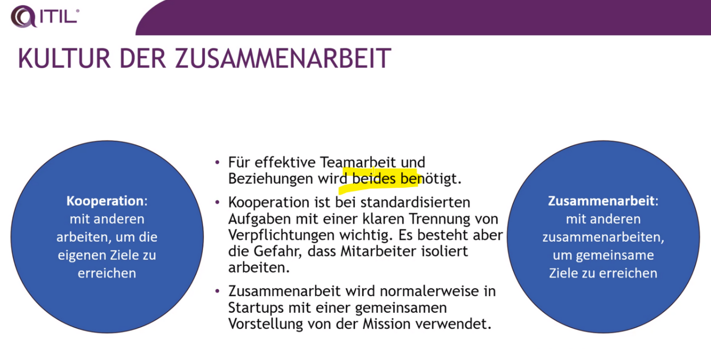

Zusammenarbeit = Gleiches Ziel  
SLA = Kooperatives Arbeiten (beide haben eigene Ziele) 

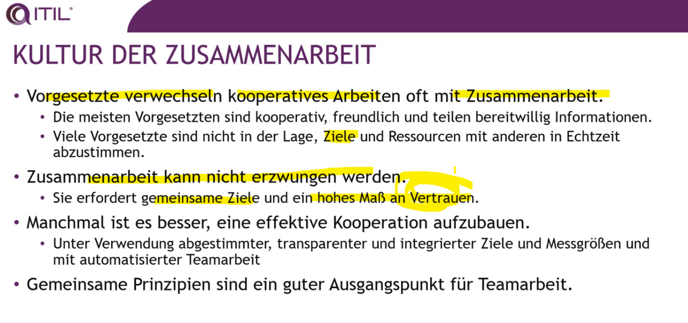

> Es kann gut sein bei manchen Themen zusammenzuarbeiten und bei andere "nur" zu kooperieren.

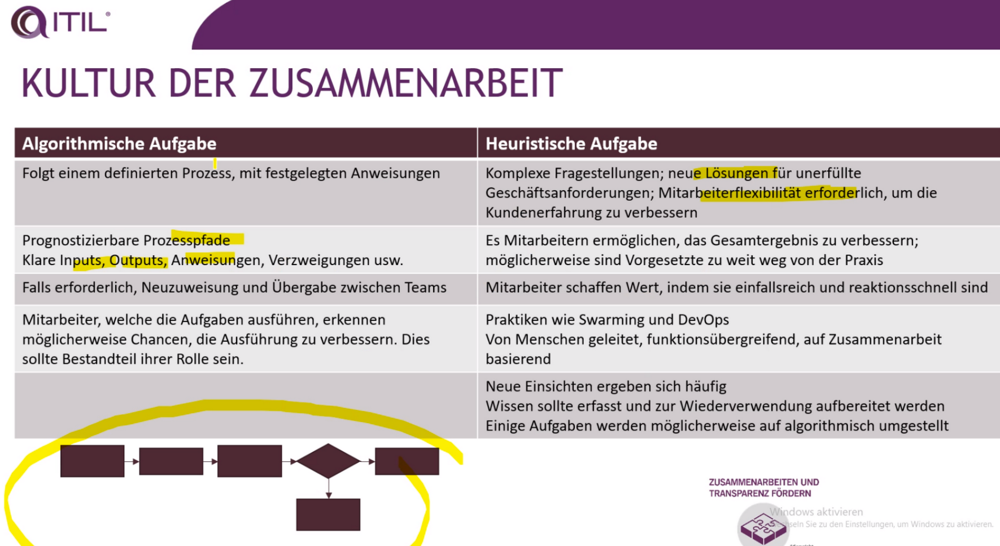

Heuristische Aufgaben werden (wenn sie gut laufen) in der Regel in eine algorithmische Aufgabe umgebaut (Stichwort Automatisierung, Checkliste, Shift Left).

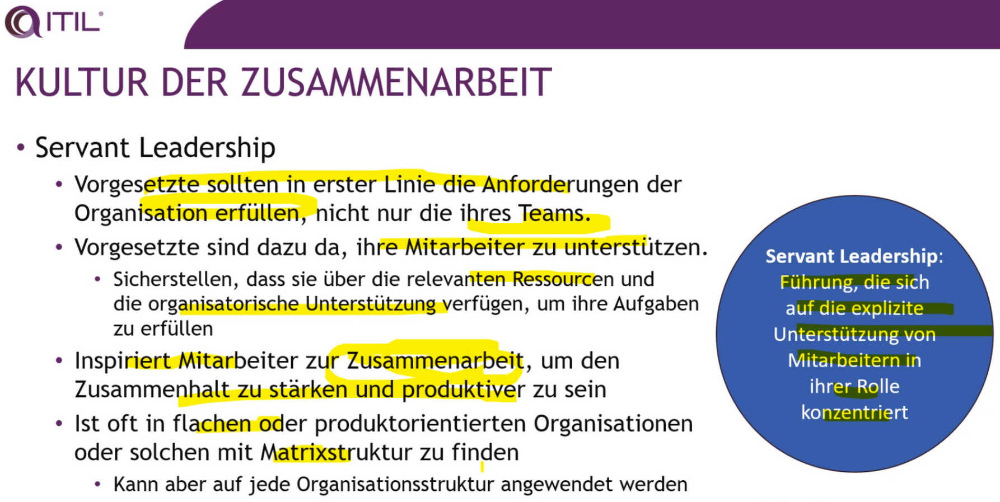

## Competence Profiles

Jede Rolle erfordert eine Kombination von Kompetenzen mit variierender Wichtigkeit.

### Beispiel KAT

- Kommunikation und Koordination sind sehr wichtig.
- Administrative Kompetenzen sind relativ wichtig.
- Technisches Wissen wird benötigt, ist aber weniger wichtig als K und A.
- Dies könnte das Profil eines Relationship Managers und Service Owners sein, der ein SLA entwirft.

### Beispiel TMA

- Technisches Wissen ist sehr wichtig.
- Kompetenzen im Methodendesign sind relativ wichtig.
- Administrative Kompetenzen sind ebenfalls erforderlich.
- Dies könnte das Profil eines Change Managers und Service Owners sein, der ein neues Change-Modell entwickelt.

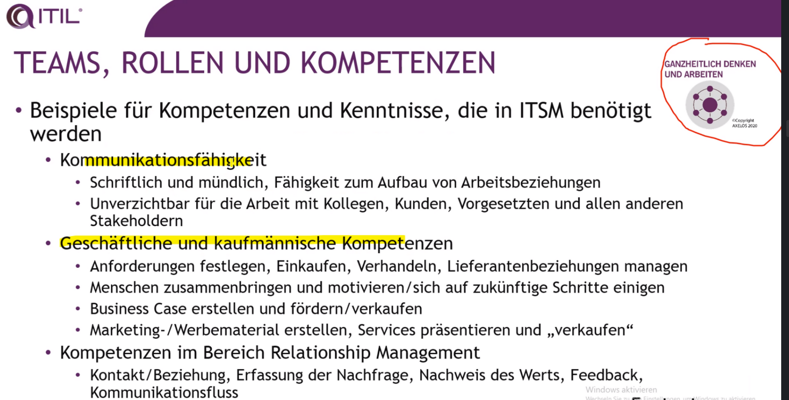

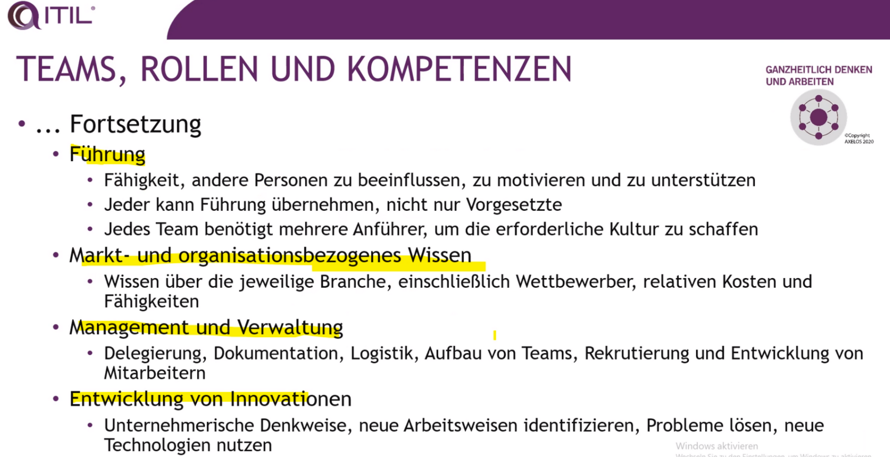

Führung erfolgt in 4 Richtungen:

- Nach oben
- Nach unten
- Seitlich
- Sich selbst

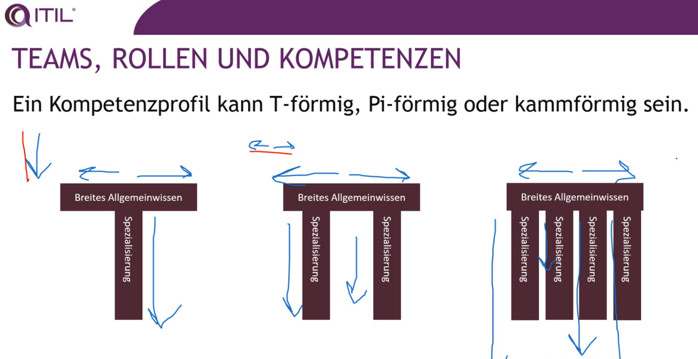

Kompetenzprofile:

- T
- Phi
- Kamm

> IT ist eine Fertigungsstrasse

Spannendes Beispiel der Fertigungsstrasse von Toyata: Mitarbeiter des Kamm-Modells können anderen helfen ihre Dinge zu lösen und steigern so die Produktivität der Fertigung.

Reminder:

- Wertstrom: Löst ein Szenario.
- Prozess: EINE Sache erledigen (mehrere Prozesse ergeben Wertstrom)

### Mitarbeiterumfragen

> Net Promoter Score

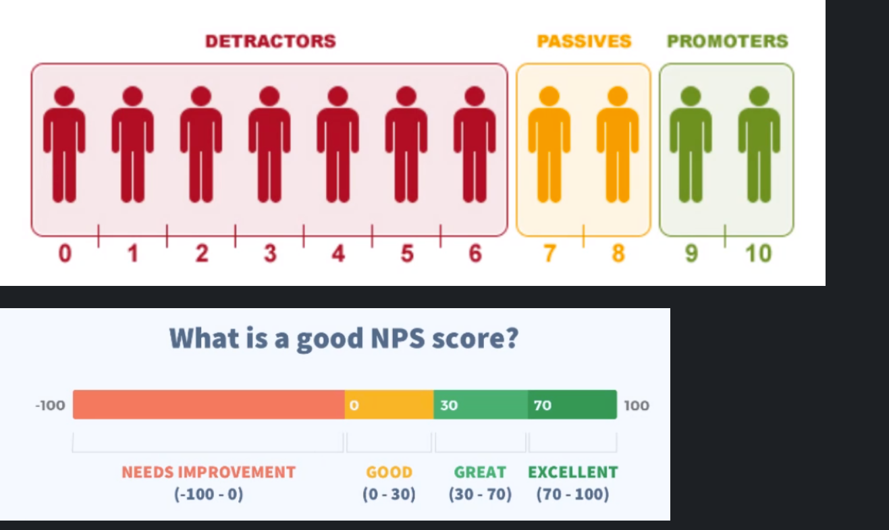

Zusätzlich gibt es noch den ENPS (Employee Net Promoter Score): Gleiches Schema!

> Was bedeutet der Begriff Toil? First Tasks to Automate.

## Shift Left

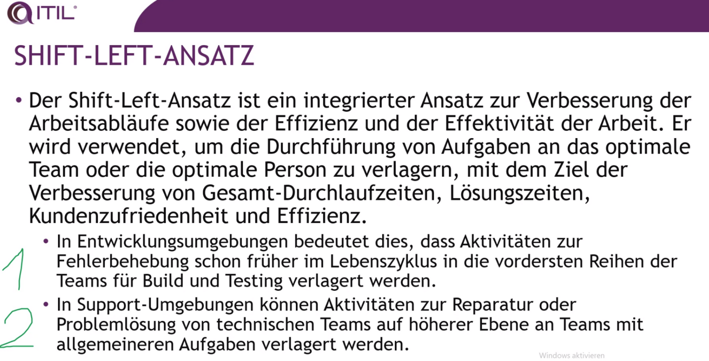

> Investiere zuerst mehr Zeit in die frühe Planung um spätere Korrekturen zu vermeiden (je später je teurer!)

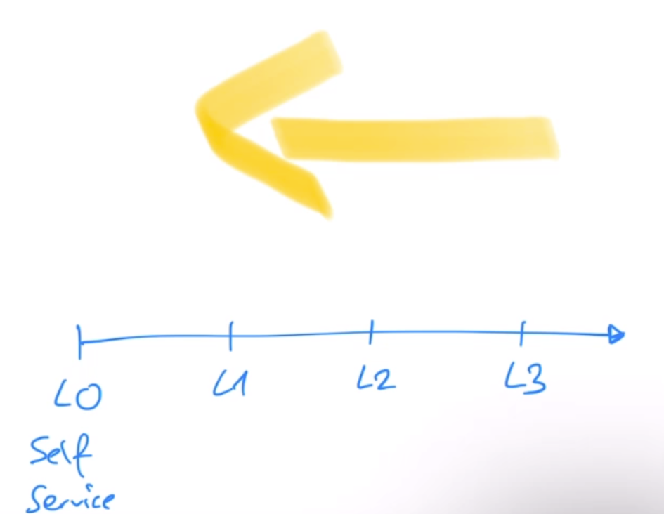

ITIL kennt keine weiteren Levels. In der Gartner Definition gibt es noch zwei weitere Levels:

Die letzte Erweiterung kommt vom Trainer:

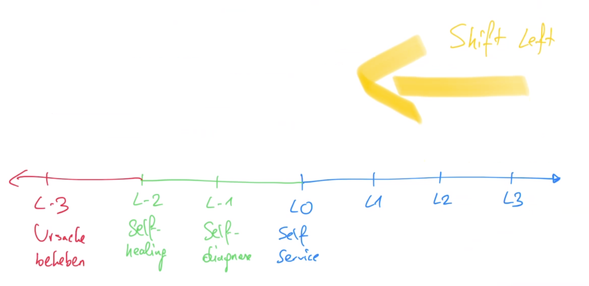

# Day