# CDS Personal Notes

> Most of this is in german. It's only intended for personal use.

# Table of Contents

## Day 1 Notes

01.[Service Value Stream](#service-value-stream) 
02.[Work Culture](#work-culture) 
04.[Competence Profiles](#competence-profiles) 
05.[Shift Left](#shift-left) 

## Day 2 Notes
06.[Personnel Planning](#personnel-planning) 
07.[Continual Improvement & Continual Deployment (CI/CP)](#continual-improvement--continual-deployment-cicp) 
08.[Value Streams](#value-streams) 
09.[ITIL Practices](#itil-practices) 
10.[Change Enablement](#change-enablement) 

## Day 3 Notes
> Coming Soon

> Easy way to remember the four dimensions of Service Management

<strong>VOIP</strong>  
<strong>V</strong>alue Stream 
<strong>O</strong>organization 
<strong>I</strong>nformation and Technology 
<strong>P</strong>Partners and Suppliers 

## Service Value Stream

> Service Wertstrom ist eine Linie.

Definition "Resilienz": Schnelle Wiederherstellung nach Fehlern und NICHT "Wiederstandsfähigkeit". Wird oft durcheinander gebracht.  

## Work Culture

Zusammenarbeit = Gleiches Ziel  
SLA = Kooperatives Arbeiten (beide haben eigene Ziele) 

> Es kann gut sein bei manchen Themen zusammenzuarbeiten und bei andere "nur" zu kooperieren.

Heuristische Aufgaben werden (wenn sie gut laufen) in der Regel in eine algorithmische Aufgabe umgebaut (Stichwort Automatisierung, Checkliste, Shift Left).

## Competence Profiles

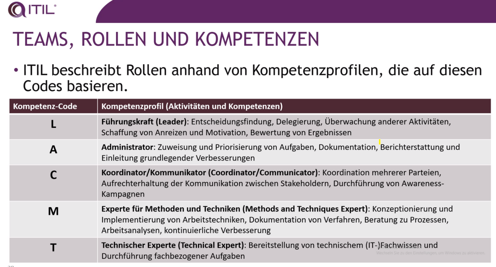

Jede Rolle erfordert eine Kombination von Kompetenzen mit variierender Wichtigkeit.

### Beispiel KAT

- Kommunikation und Koordination sind sehr wichtig.
- Administrative Kompetenzen sind relativ wichtig.
- Technisches Wissen wird benötigt, ist aber weniger wichtig als K und A.
- Dies könnte das Profil eines Relationship Managers und Service Owners sein, der ein SLA entwirft.

### Beispiel TMA

- Technisches Wissen ist sehr wichtig.
- Kompetenzen im Methodendesign sind relativ wichtig.
- Administrative Kompetenzen sind ebenfalls erforderlich.
- Dies könnte das Profil eines Change Managers und Service Owners sein, der ein neues Change-Modell entwickelt.

Führung erfolgt in 4 Richtungen:

- Nach oben
- Nach unten
- Seitlich
- Sich selbst

Kompetenzprofile:

- T
- Phi
- Kamm

> IT ist eine Fertigungsstrasse

Spannendes Beispiel der Fertigungsstrasse von Toyata: Mitarbeiter des Kamm-Modells können anderen helfen ihre Dinge zu lösen und steigern so die Produktivität der Fertigung.

Reminder:

- Wertstrom: Löst ein Szenario.
- Prozess: EINE Sache erledigen (mehrere Prozesse ergeben Wertstrom)

### Mitarbeiterumfragen

> Net Promoter Score

Zusätzlich gibt es noch den ENPS (Employee Net Promoter Score): Gleiches Schema!

> Was bedeutet der Begriff Toil? First Tasks to Automate.

## Shift Left

> Investiere zuerst mehr Zeit in die frühe Planung um spätere Korrekturen zu vermeiden (je später je teurer!)

ITIL kennt keine weiteren Levels. In der Gartner Definition gibt es noch zwei weitere Levels:

Die letzte Erweiterung kommt vom Trainer:

# Day 2

- Definition "Proaktives Problemmanagement" -> Es ist noch KEIN Incident passiert.

Agiler Ansatz: Backlog -> Es wird von Monat zu Monat umgesetzt, wann es fertig ist weiss aber keiner.

## Personnel Planning

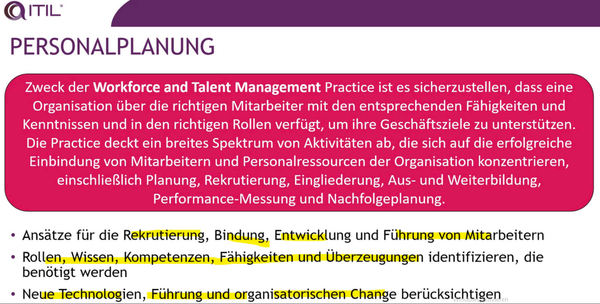

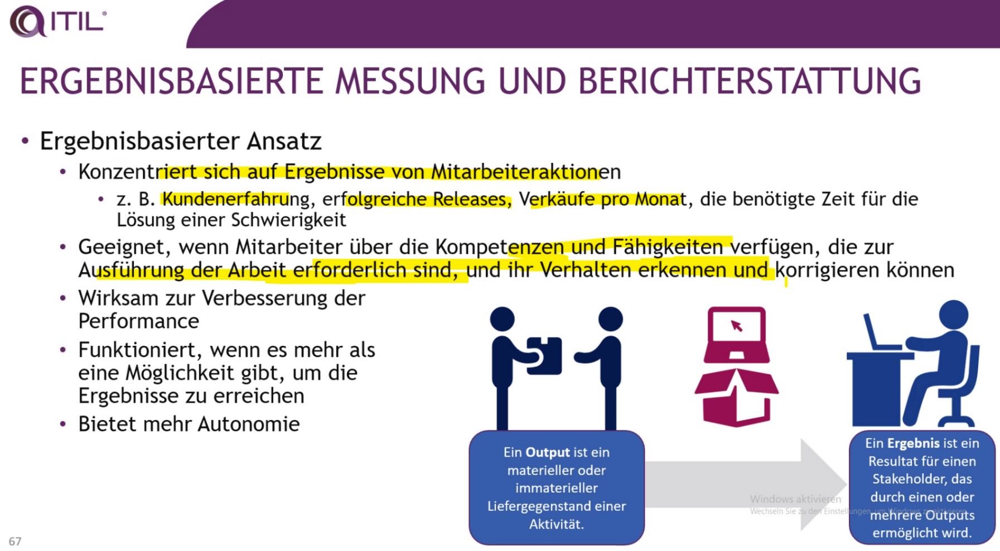

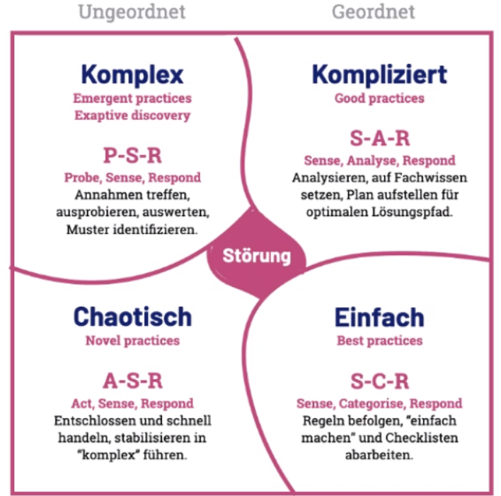

Wir lernen über ein Führungskräfe-Assessement: Ich treffe nur neue Entscheidungen wenn sich meine Informationen geändert haben auf deren Grundlage ich eine Entscheidung treffe.

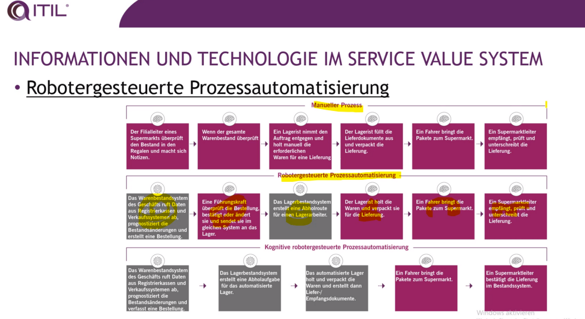

## Continual Improvement & Continual Deployment (CI/CP)

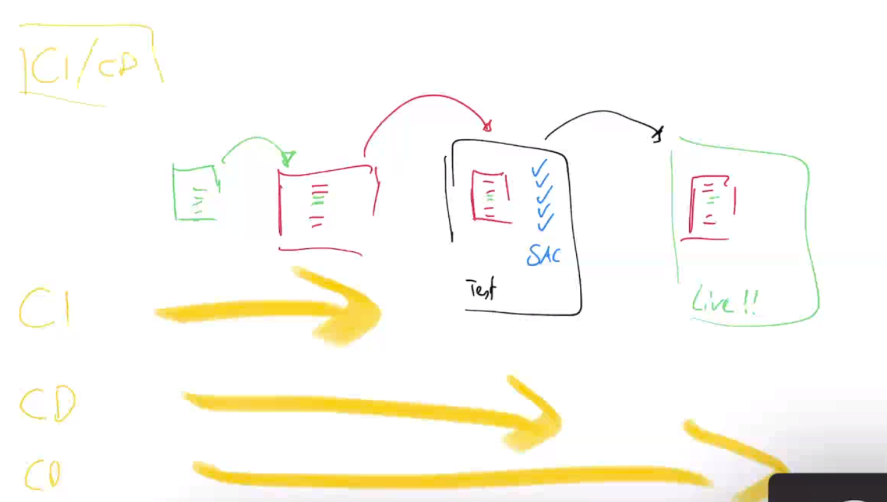

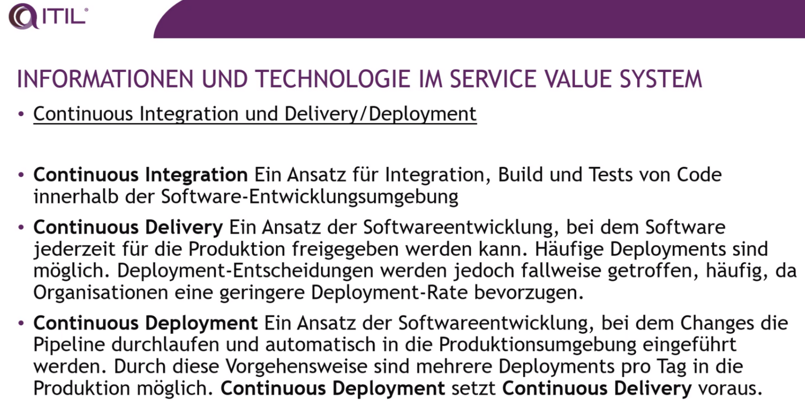

## Value Streams

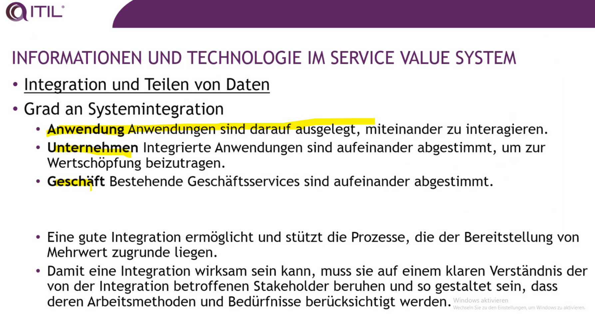

## ITIL Practices

### Service Design Practice

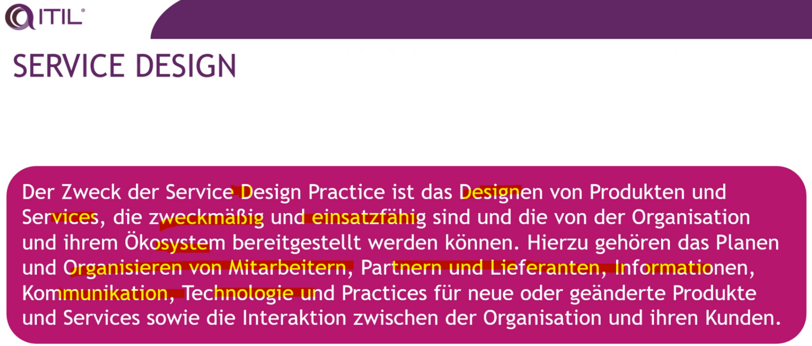

Recommendation by Trainer: Design Thinking Course.

> Für jede Practice gilt: Ansatz und einzelner Durchlauf muss erfolgreich sein.

### Software Development and Management Practice

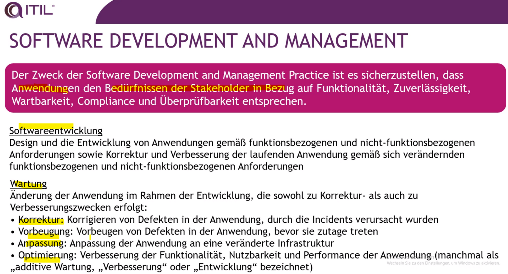

### Deployment Management Practice

### Release Management Practice

### Service Validation and Testing Practice

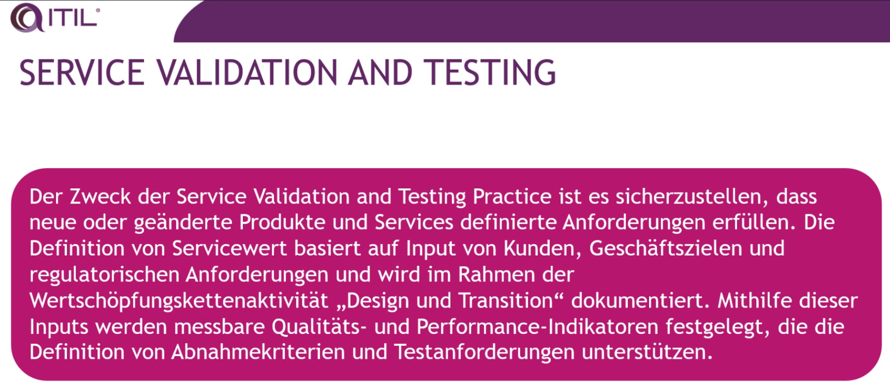

> SAC = Service Acceptance Criteria

SAC sollte immer 2 Listen haben. Eine Liste für early life Support (SAC) und eine zweite Liste für Live/Vollbetrieb.

Beispiel: Ich fange 1 nur an wenn es keine großen Incidents mehr gibt. Liste 2= es existieren KEINE Incidents mehr.

Bei Ausgrenzung als Stakeholder gilt: PUSH-Verantwortung, hineinreklamieren bis man am Tisch sitzt.

- ORM = Bekannt implizit -> War nie definiert aber ist klar das mans mal versucht (Beispiel HR Lohnverrechnung was ist wenn da mal 0 Gehalt drinsteht oder -1) 
- ATI = Unbekannt -> Was passiert wenn ich einen Buchstaben eingebe statt ein Gehalt?
- ON = Software stürzt ab wenn ich chinesische Buchstaben eingebe.

## Change Enablement

