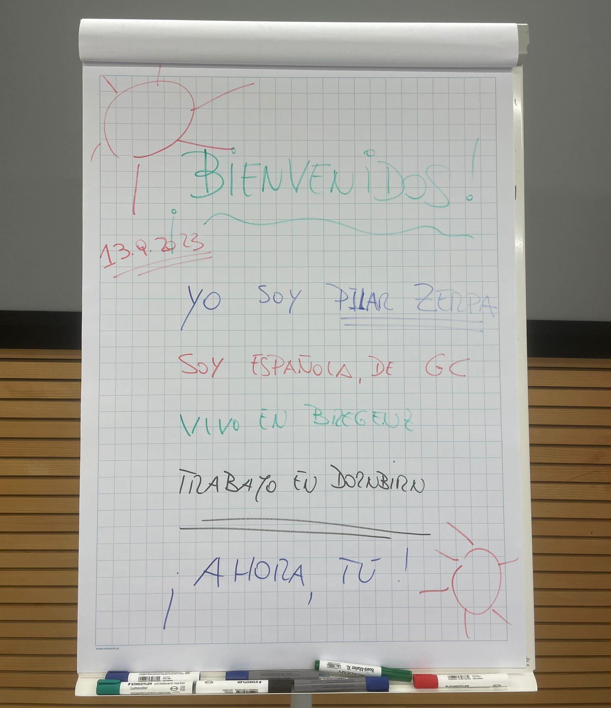
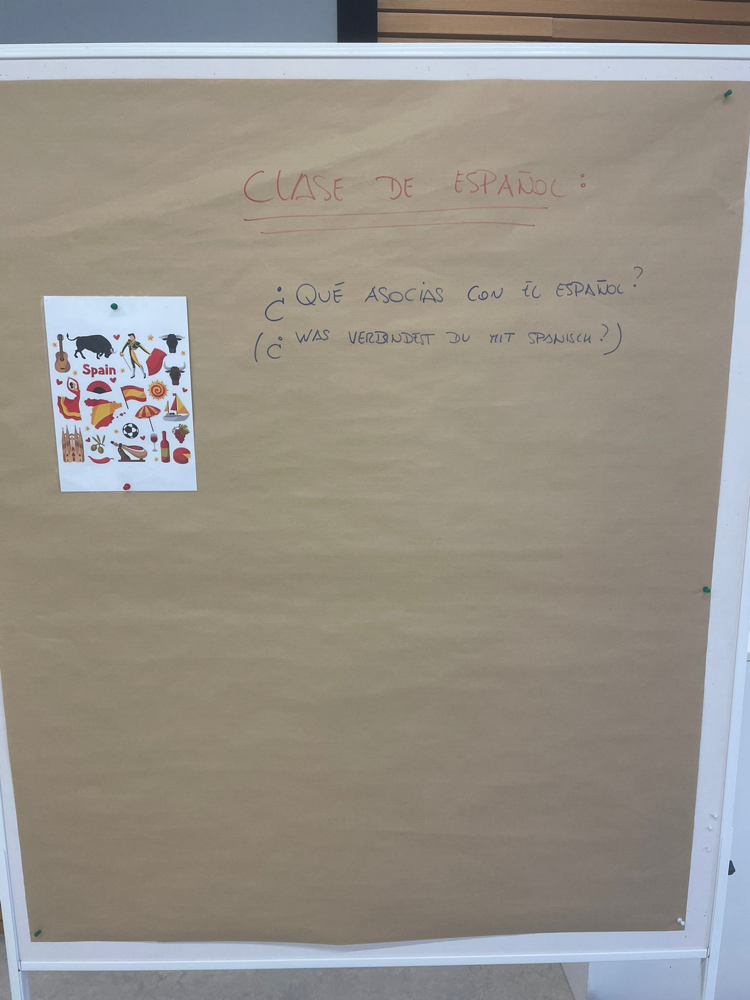
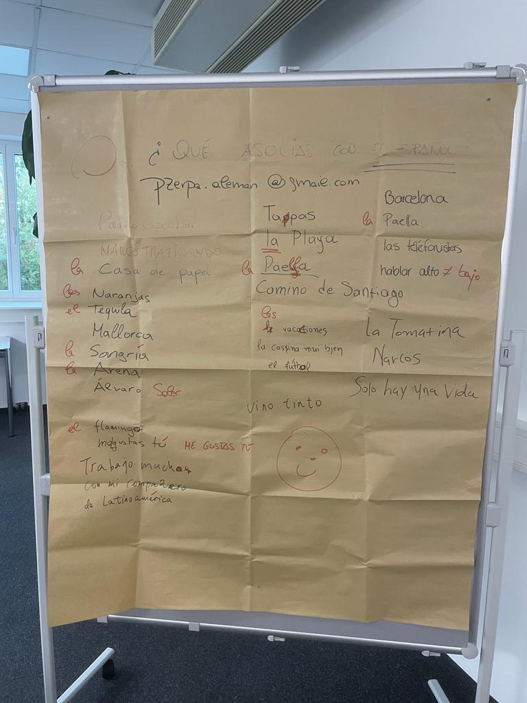
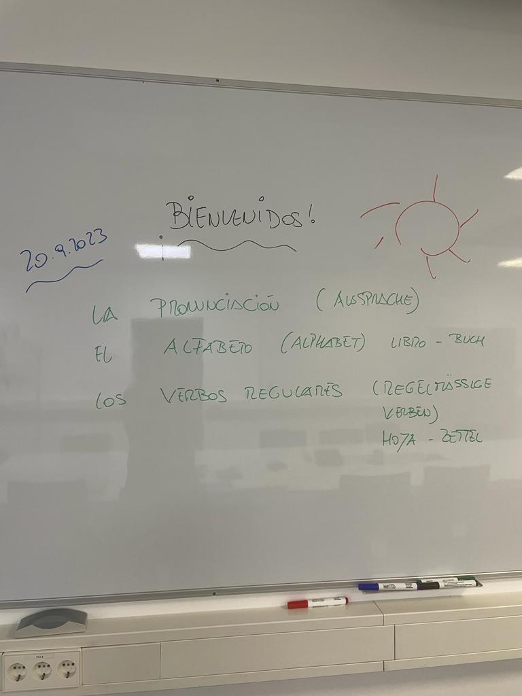
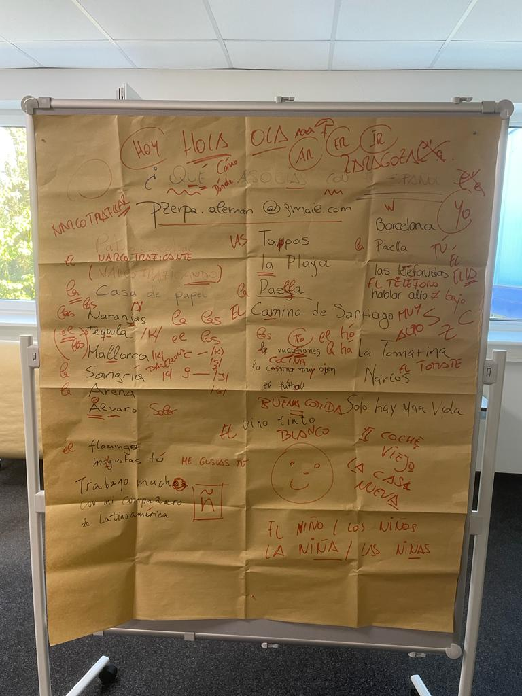
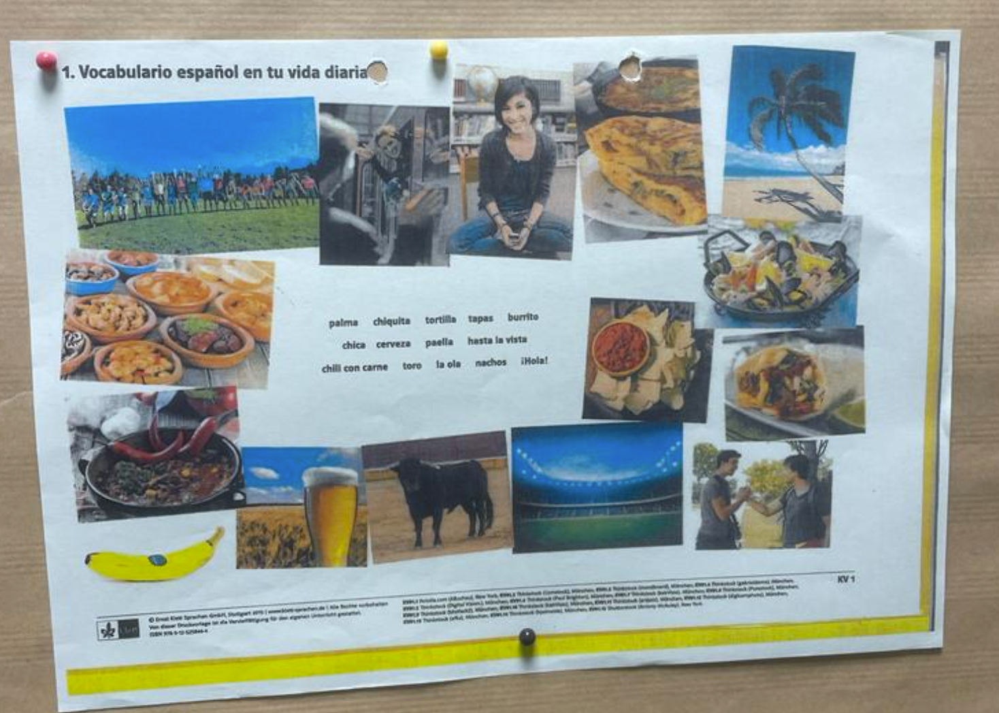

# Session 1

## Presente (Gegenwart) de Indicativo

En Espanol hay tres conjugaciones regulares: -Ar, -Er, Ir

|   | HABLAR | COMER | VIVIR |
|---|--------|-------|-----|
| Yo | hablo | como | vivo|
| Tú | hablas | comes | vives |
| Él/Ella/Usted | habla | come | vive |
| Nosotros | hablamos | comemos | vivimos |
| Ellos/ellas/Ustedes | hablan | comen | viven |

### Verbos Reflexivos (Rückbezüglich): LLAMARSE

| Yo | me llamo |
|----|----------|
| Tú | te llamas |
| Èl/Ella/Usted | se llama |
| Nosotros | nos llamamos |
| Vosotros | os llamáis |
| Ellos/Ellas/Ustedes | se llaman |

### Verbos Irregulares Importantes:

| ESTAR | SER |
|-------|-----|
| Estoy | soy |
| Estás | eres |
| Está | es |
| Estamos | somos |
| Estáis | sóis |
| Están | son |

Estoy en Bregenz (Ich bin in Bregenz - sich befinden)
Yo soy espanol (Komme aus Spanien - Ursprung, Herkunft)

|HACER |VENIR| IR | TENER|
|----|----|----|----|
| hago|vengo|voy|tengo|
|haces|vienes|vas|tienes|
|hace|viene|va|tiene|
|hacemos|venimos|vamos|tenemos|
|hacéis|venis|vais|tenéis|
|hacen|vienen|van|tienen

IR a hacer algo = etwas tun werden
TENER QUE + infinitivo (nennform) = müssen