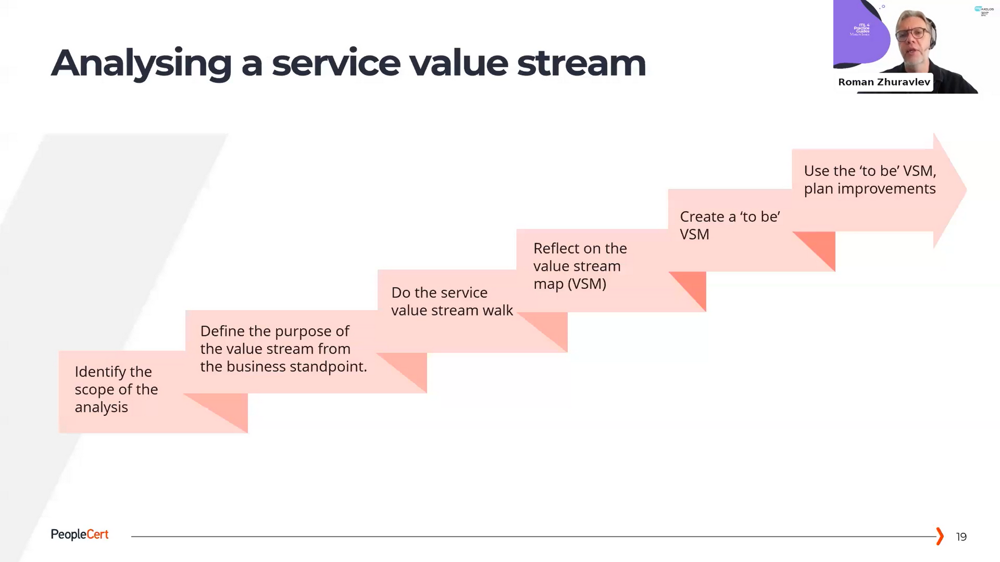

> A must-have introduction to the structure, the content, and application of the ITIL 4 Practice Guides.

Speakers:

> Roman Zhuravlev (Senior ITIL Architect)
> Adam Griffith (ITIL Architect)

- ITIL Practice Guides are in Focus of ITIL right now.
- Rework of most practices is happening right now.
- Certifications related to Practices are introduced.

 

 
 # Practice Success Factors
 
 For each Practice there are clearly defined success factors that have been defined.
 
 As an example, for incident management practice to achieve it's purpose, the service provider needs to:
 
 - Detect incidents early.
 - Resolve incidents quickly and efficiently.
 - Continually improve incident management.

For each PSF there are cearly defined key metrics in the practice guides; making this easy to apply to a real-world scenario.

# Processes and  Value Streams

> Each practice includes more than one process

# Organizations and People

> Only few key roles and described in every practice guide (and examinable):

- Responsibilities
- Competencies
- Recommendations on organizational positioning

Practice guides maps responsibilities to the competence profiles.

# Information and Technology

> Tools are listed that would support specific practices

# Partners and Suppliers

For Partners and Suppliers each practice guide contains dependencies of the practice on suppliers and partners.

It also mentions how partners and suppliers can support the practice by:

- Participation in the practice activities
- Provision of software tools
- Consulting

# ITIL 4 Maturity Model

- Maturity assessment of the SVS (Service Value System)
- Capability assessment of the practices
- Assessment of the IT service governance and management system, NOT of ITIL implementation
- Available via Axelos Consulting Partners

Example of Cabability Criteria below:

# Recommendations 

> Recommendations link specific advice for each practice with the existing ITIL Guiding principles.

